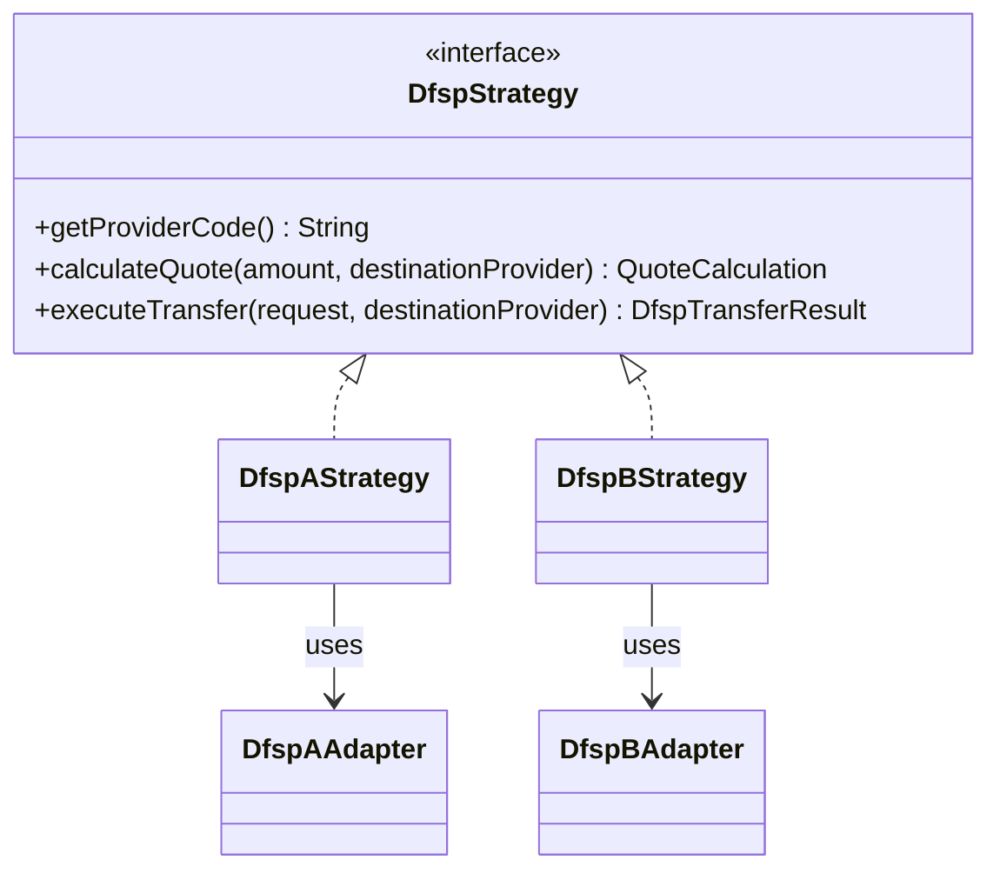
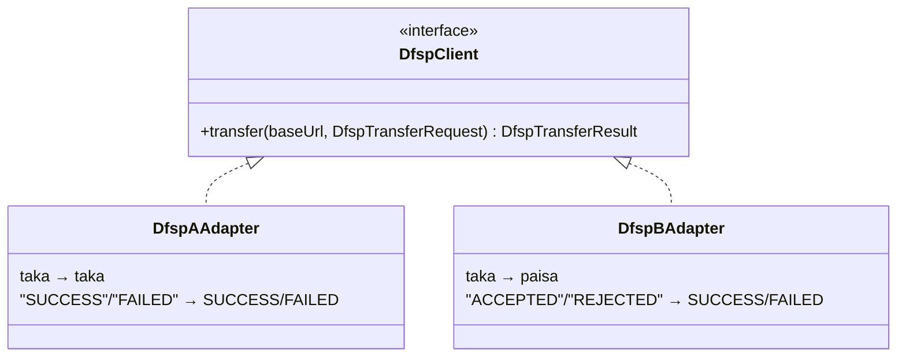
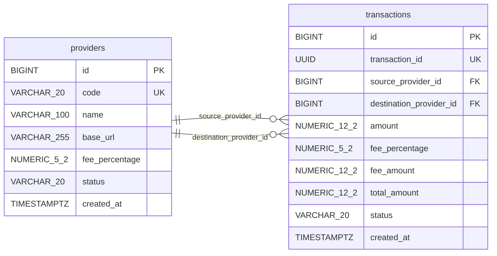
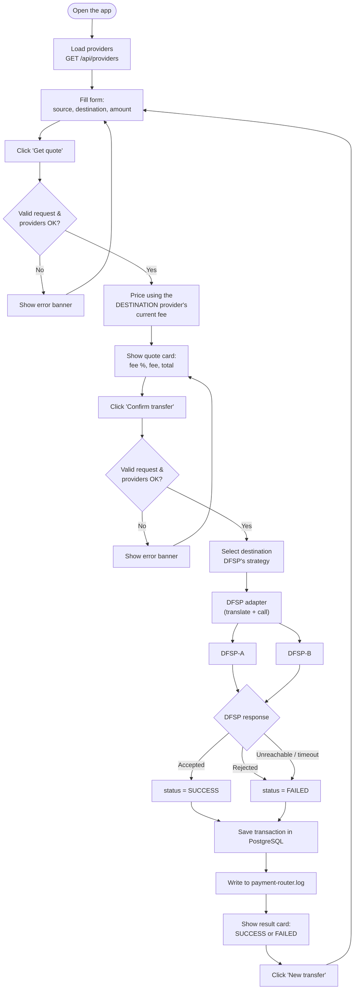

# Mini Payment Router Simulator

A small system standing between two Digital Financial Service Providers (DFSPs). It
quotes a transfer before anything moves, prices every transfer from the *destination*
provider's current fee, and records the outcome — success or failure — as a permanent
row nothing else quietly rewrites. It's built the way a real router has to be: money
handled as exact decimals, two DFSPs with genuinely incompatible wire formats hidden
behind one adapter each, and a rejected or unreachable transfer that's still a fact
worth keeping, not an error that vanishes.

## 1. Tech stack

- **Backend** — Spring Boot 4.1 (Java 21), Spring Data JPA / Hibernate
- **Database** — PostgreSQL 16
- **Frontend** — React 19, Vite 8, served in production by Nginx
- **Testing** — JUnit 5, Mockito, bash + curl smoke test
- **Containerization** — Docker, Docker Compose

---

## 2. What it does

- **Quote** — `POST /api/quotes`: fee % and total for a transfer, priced from the
  destination provider. Nothing is sent or stored.
- **Transfer** — `POST /api/transfers`: routed to the destination DFSP over HTTP; the
  outcome is recorded either way.
- **Two dummy DFSPs, deliberately incompatible** — DFSP-A speaks decimal taka and
  `SUCCESS`/`FAILED`; DFSP-B speaks integer paisa and `ACCEPTED`/`REJECTED`. An adapter
  per DFSP hides the difference from the rest of the app.
- **Database-driven, provider-specific fees** — DFSP-A 1.00%, DFSP-B 1.50%, changeable
  with one SQL `UPDATE`, no redeploy.
- **Consistent JSON error shape** for every 4xx/5xx response.
- **File logging** to `logs/payment-router.log` — request, DFSP call, and outcome.
- **Docker Compose**: one command, five services, healthchecks, service-name networking.

Two properties are load-bearing and worth stating up front:

- **The fee always comes from the destination provider, and it's frozen onto the
  transaction the instant it's charged.** A fee changed tomorrow never rewrites what a
  transfer cost yesterday — there is no recalculation, ever.
- **Every transfer that passes validation is recorded, success or failure.** A DFSP
  that rejects it, times out, or can't be reached still leaves a row. Nothing is
  silently dropped.

---

## 3. Setup and run instructions

Only prerequisite: **Docker** with Docker Compose v2. No local Java, Maven, or Node.js
needed — everything runs in containers.

```bash
git clone <repository-url>
cd "Mini Payment Router Simulator"
docker compose up --build
```

That's it. The database schema and the two providers (`DFSP_A`, `DFSP_B`) are created
automatically on first boot — no manual migration or seed step.

Once the containers are healthy, open:

- **Frontend**: http://localhost:3000
- **Payment Router API**: http://localhost:8080/api/status
- **DFSP-A / DFSP-B** (direct access): http://localhost:8081 / http://localhost:8082
- **PostgreSQL**: internal only, not published to the host (see [Architecture](#4-architecture))

Need a different frontend port or DB credentials? Copy `.env.example` to `.env` and
edit it — every value already has a working default, so this step is optional.

There is nothing to sign up for or log into — every endpoint is open (authentication
is intentionally out of scope for this assessment).

If port 3000 is already in use:

```bash
FRONTEND_PORT=3001 docker compose up --build          # bash
$env:FRONTEND_PORT="3001"; docker compose up --build  # PowerShell
```

**5. Stop the stack**

```bash
docker compose down        # stop, keep the database volume
docker compose down -v     # also remove the volume — a clean-slate reset
```

Data survives a plain `down`/`up` — Postgres writes to a named volume (`pgdata`), not
the container's own filesystem.

**Everyday commands**

```bash
docker compose up --build              # (re)build images and start everything
docker compose logs -f payment-router  # tail one service's logs
docker compose ps                      # check what's running and healthy
```

### Running without Docker (optional)

For local development you can also run each service directly. This needs **Java 21**
and **Node.js 20.19+ or 22.12+** (Maven is not needed — each backend includes the Maven
Wrapper).

1. Start PostgreSQL on port 5433 (separate from the Compose database):
   ```bash
   docker run -d --name payment-router-postgres-dev -p 5433:5432 \
     -e POSTGRES_DB=payment_router -e POSTGRES_USER=router -e POSTGRES_PASSWORD=router \
     postgres:16-alpine
   ```
2. Start the three backends, each in its own terminal:
   ```bash
   cd backend/dfsp-a         && ./mvnw spring-boot:run   # :8081
   cd backend/dfsp-b         && ./mvnw spring-boot:run   # :8082
   cd backend/payment-router && ./mvnw spring-boot:run   # :8080
   ```
3. Start the frontend:
   ```bash
   cd frontend && npm install && npm run dev   # http://localhost:5173
   ```

The local log file is written to `backend/payment-router/logs/payment-router.log`.

---

## 4. Architecture


- The browser talks only to `frontend`; Nginx forwards `/api/*` to `payment-router`, so
  the browser sees a single origin.
- Only `payment-router` talks to `postgres`, `dfsp-a` and `dfsp-b`. The DFSPs never talk
  to each other or to the database.
- Containers reach each other by Compose **service name** (`postgres:5432`,
  `http://dfsp-a:8081`), never by `localhost`.

**Layers inside `payment-router`**

```
Controller → Service → DfspStrategy → DfspClient (adapter) → DFSP over HTTP
                │
                └────→ Repository → PostgreSQL
```

| Package | Responsibility |
|---------|----------------|
| `controller` | HTTP endpoints; triggers `@Valid`; delegates to services |
| `service` | Business validation, quote calculation, transfer orchestration; picks the strategy matching the destination provider's code |
| `strategy` | One strategy per DFSP (pricing + which adapter to call) |
| `client` | Adapters translating to and from each DFSP's own API |
| `entity`, `repository` | JPA entities and Spring Data repositories |
| `exception` | Custom exceptions and the global error handler |
| `config` | HTTP client timeouts, CORS, provider seed data |

**Service responsibilities**

- **Frontend** — form for source/destination/amount; shows the quote and the transfer result; no business logic.
- **Payment Router** — validates requests, calculates quotes, routes transfers via the right strategy/adapter, saves every attempt, logs events.
- **DFSP-A** — dummy provider, own API format, rejects transfers above 50,000.00 taka.
- **DFSP-B** — dummy provider, deliberately different API format (paisa, different fields), rejects transfers above 25,000.00 taka.
- **PostgreSQL** — stores providers and transactions only; reachable only by `payment-router`.

| Aspect | DFSP-A | DFSP-B |
|---|---|---|
| Endpoint | `POST /api/dfsp-a/transfers` | `POST /v1/payments/receive` |
| Request fields | `transactionId`, `sourceProvider`, `amount`, `fee` | `clientRef`, `senderDfsp`, `amountInPaisa`, `feeInPaisa` |
| Money unit | Decimal taka (`1000.00`) | Integer paisa (`100000`) |
| Success response | `{ "status": "SUCCESS", "referenceId": ... }` | `{ "result": "ACCEPTED", "paymentRef": ... }` |
| Failure response | `{ "status": "FAILED", "message": ... }` | `{ "result": "REJECTED", "reason": ... }` |

## 5. Design Patterns

### 5.1 Strategy Pattern — isolates DFSP-specific behaviour



- **Strategy** — each DFSP has its own class that knows how to price and transfer for
  that provider. So the code never says "if DFSP_A do this, else do that" — it just
  asks "give me the strategy for this provider" and calls it. Adding a new DFSP means
  adding a new class, not editing existing logic.

### 5.2 Adapter Pattern — hides DFSP API differences


- **Adapter** — DFSP-A and DFSP-B each speak a completely different API (different
  field names, different money units, different status words). The adapter's only job
  is translating between the router's common format and that one DFSP's format, so the
  rest of the app never has to care which DFSP it's talking to.

---

## 6. Database schema

Exactly two tables. Hibernate creates them from the JPA entities.



Two independent relationships connect the same two tables — `source_provider_id` and
`destination_provider_id` both point at `providers.id`. A transaction's source and
destination may point at the *same* provider row (e.g. `DFSP_A` → `DFSP_A`). There is
no `quotes` table: a quote is a calculation, not a business record.

**Notes on constraints not visible in the diagram:**

- `providers.code` and `transactions.transaction_id` each have a named unique
  constraint (`uk_providers_code`, `uk_transactions_transaction_id`).
- Both foreign keys on `transactions` are `NOT NULL` and named
  (`fk_transactions_source_provider`, `fk_transactions_destination_provider`) — a
  transaction always has both a source and a destination.
- `transactions` has **no update path** for its pricing columns (no setters exist in
  the Java entity) — once saved, `fee_percentage`, `fee_amount` and `total_amount`
  never change, by construction rather than by convention.
- Money is `NUMERIC` in Postgres and `BigDecimal` in Java everywhere; `double` is never
  used for an amount.

---

## 7. App flow



Both `SUCCESS` and `FAILED` outcomes reach `Save` — a rejected, unreachable or
timed-out transfer is still recorded, never silently dropped.

---

## 8. How it works

### Quotes and transfers

A quote and a transfer start exactly the same way: pick a source provider, a
destination provider, and an amount. A **quote** just does the maths and stops there —
it doesn't call anyone else and doesn't save anything, so asking for a quote is always
free and safe to repeat. A **transfer** does everything a quote does, and then actually
sends the money: it calls the destination DFSP over HTTP, waits for its answer, and
saves exactly one row in the database — no matter what that answer turns out to be.

### Provider-specific fees

Every DFSP has its own fee percentage stored in the database — DFSP-A charges 1.00%,
DFSP-B charges 1.50%. The one rule that decides which fee applies is simple, but easy
to get backwards if you're not careful: **the router always charges the fee of the
provider *receiving* the money, not the one sending it.** So a transfer from A to B
uses DFSP-B's fee, and a transfer from B to A uses DFSP-A's fee — same two providers,
different fee, depending only on which one is the destination.

Once a transfer is saved, its fee is frozen forever. If someone updates DFSP-B's fee to
2% tomorrow, every transfer made *today* still shows the 1.50% it actually paid — the
database never goes back and recalculates old rows.

### When a DFSP fails

A transfer can go wrong in three different ways, and the router treats all three the
same way underneath: it still saves a row, just with `status = FAILED` instead of
`SUCCESS`, and a message explaining what happened.

1. **The DFSP answers, but says no** — for example, the amount is above its limit. Its
   own reason is saved word-for-word.
2. **The DFSP can't be reached at all** — wrong address, or the container is down.
   Saved as *"Destination DFSP is unavailable."*
3. **The DFSP is reachable but never answers in time** (3 seconds to connect, 5 seconds
   to respond). Saved as *"Destination DFSP did not respond in time."*

None of these three ever crash the router or send back a scary server error — from the
outside they all look like a normal, successful HTTP request that happens to contain
`"status": "FAILED"`.

---

## 9. Validation

| Rule | Where | Mechanism |
|---|---|---|
| Amount is required and greater than zero | Request DTO | `@NotNull`, `@Positive` + `@Valid` |
| At most 9 integer digits, 2 decimal places | Request DTO | `@Digits(integer = 9, fraction = 2)` |
| Source provider is required | Request DTO | `@NotBlank` |
| Destination provider is required | Request DTO | `@NotBlank` |
| Provider exists and is ACTIVE | `PaymentRequestValidator` | DB lookup → 400 |

Source and destination are **allowed to be the same provider**. A DFSP sending a payment to
itself (e.g. `DFSP_A` → `DFSP_A`) is validated, priced and routed exactly like any other
transfer, using that provider's own strategy and adapter.

Request validation runs first (`@Valid`), so an invalid request never reaches a service.
`GlobalExceptionHandler` (`@RestControllerAdvice`) converts `MethodArgumentNotValidException`
(field errors) and `InvalidPaymentRequestException` (business rules) into the error JSON above.
Quote and transfer share the same business checks through `PaymentRequestValidator`.
The 9-digit limit keeps `amount + fee` inside the `NUMERIC(12,2)` columns, so a very large amount
is rejected with 400 instead of failing when the transaction is saved.

---

## 10. Logging

- Uses Spring Boot's default **SLF4J + Logback**. File output is enabled with `logging.file.name`.
- `logging.file.name=logs/payment-router.log` is relative to the working directory: `backend/payment-router/logs/payment-router.log` when run locally, `/app/logs/payment-router.log` inside the container (bind-mounted to `./logs` on the host).
- Logs go to both the console and the file. The file rolls at 10 MB, and 7 days of history are kept.
- Test runs write to `target/test-logs/payment-router-test.log` (Surefire system property), so they never mix with application logs.
- DFSP adapters log the DFSP-specific request and response (`DFSP-B request: POST ... DfspBPaymentRequest[...]`).

| Event | Level | Example content |
|---|---|---|
| Quote request | INFO | source, destination, amount |
| Transfer request | INFO | source, destination, amount, transactionId |
| DFSP request | INFO | provider, URL, transactionId |
| DFSP response | INFO | provider, mapped status, reference/message |
| Successful transfer | INFO | transactionId, fee, total |
| Failed transfer | WARN | transactionId, reason |
| Validation failure | WARN | message |
| Exceptions (DFSP down, others) | ERROR | message + stack trace |

Dummy DFSPs log to the console only (`docker compose logs dfsp-a`). The
assignment's file-logging requirement is met in the main backend, which keeps
the DFSPs minimal.

---

## 11. Trying it out

1. Open **http://localhost:3000**. Providers load automatically into the two dropdowns.
2. **Quote DFSP-A → DFSP-B, amount 1000**: fee `15.00` (DFSP-B's 1.50%), total `1015.00`
   — the *destination's* fee, not the source's.
3. **Confirm the transfer** → `SUCCESS`, a transaction ID, and a row saved in Postgres.
4. **Reverse the direction**: DFSP-B → DFSP-A, same amount. The fee is now `10.00`
   (DFSP-A's 1.00%) — the destination changed, so the fee did too.
5. **Push DFSP-B over its limit** (amount `30000`) → `FAILED`, DFSP-B's own reason quoted
   back — and still saved as a row.
6. **Stop the destination DFSP** (`docker compose stop dfsp-b`) and try again → `FAILED`,
   *"Destination DFSP is unavailable"*. The router itself never crashes.
7. **Change a fee mid-flight**:
   ```sql
   UPDATE providers SET fee_percentage = 2.00 WHERE code = 'DFSP_B';
   ```
   New quotes use `2.00%` immediately. The transaction from step 3 still shows `1.50%`.
