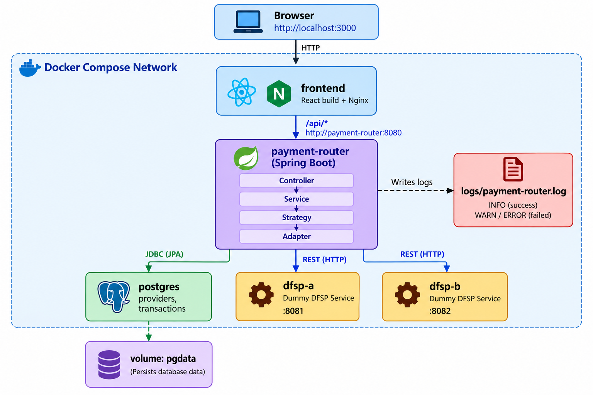
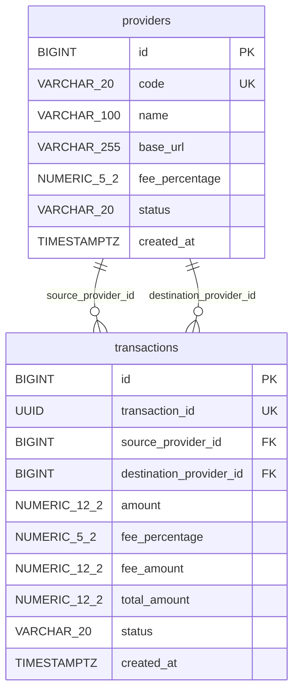

# Mini Payment Router Simulator

A small system standing between two Digital Financial Service Providers (DFSPs). It
quotes a transfer before anything moves, prices every transfer from the *destination*
provider's current fee, and records the outcome — success or failure — as a permanent
row nothing else quietly rewrites. It's built the way a real router has to be: money
handled as exact decimals, two DFSPs with genuinely incompatible wire formats hidden
behind one adapter each, and a rejected or unreachable transfer that's still a fact
worth keeping, not an error that vanishes.

## Table of contents

- [Mini Payment Router Simulator](#mini-payment-router-simulator)
  - [Table of contents](#table-of-contents)
  - [Tech stack](#tech-stack)
  - [What it does](#what-it-does)
  - [Setup and run instructions](#setup-and-run-instructions)
  - [Architecture](#architecture)
  - [Database schema](#database-schema)
  - [Workflow](#workflow)
  - [How it works](#how-it-works)
    - [Quotes and transfers](#quotes-and-transfers)
    - [Provider-specific fees](#provider-specific-fees)
    - [When a DFSP fails](#when-a-dfsp-fails)
    - [Frontend state](#frontend-state)
    - [Authentication](#authentication)
  - [Notable design decisions](#notable-design-decisions)
  - [Trying it out](#trying-it-out)
  - [Tests](#tests)
  - [API reference](#api-reference)
    - [Payment Router (`/api`)](#payment-router-api)
    - [Dummy DFSP APIs](#dummy-dfsp-apis)

## Tech stack

- **Backend** — Spring Boot 4.1 (Java 21), Spring Data JPA / Hibernate
- **Database** — PostgreSQL 16
- **Frontend** — React 19, Vite 8, served in production by Nginx
- **Testing** — JUnit 5, Mockito, bash + curl smoke test
- **Containerization** — Docker, Docker Compose

---

## What it does

- **Quote** — `POST /api/quotes`: fee % and total for a transfer, priced from the
  destination provider. Nothing is sent or stored.
- **Transfer** — `POST /api/transfers`: routed to the destination DFSP over HTTP; the
  outcome is recorded either way.
- **Two dummy DFSPs, deliberately incompatible** — DFSP-A speaks decimal taka and
  `SUCCESS`/`FAILED`; DFSP-B speaks integer paisa and `ACCEPTED`/`REJECTED`. An adapter
  per DFSP hides the difference from the rest of the app.
- **Database-driven, provider-specific fees** — DFSP-A 1.00%, DFSP-B 1.50%, changeable
  with one SQL `UPDATE`, no redeploy.
- **Consistent JSON error shape** for every 4xx/5xx response.
- **File logging** to `logs/payment-router.log` — request, DFSP call, and outcome.
- **Docker Compose**: one command, five services, healthchecks, service-name networking.

Two properties are load-bearing and worth stating up front:

- **The fee always comes from the destination provider, and it's frozen onto the
  transaction the instant it's charged.** A fee changed tomorrow never rewrites what a
  transfer cost yesterday — there is no recalculation, ever.
- **Every transfer that passes validation is recorded, success or failure.** A DFSP
  that rejects it, times out, or can't be reached still leaves a row. Nothing is
  silently dropped.

---

## Setup and run instructions

Only prerequisite: **Docker** with Docker Compose v2. No local Java, Maven, or Node.js
needed — everything runs in containers.

```bash
git clone <repository-url>
cd "Mini Payment Router Simulator"
docker compose up --build
```

That's it. The database schema and the two providers (`DFSP_A`, `DFSP_B`) are created
automatically on first boot — no manual migration or seed step.

Once the containers are healthy, open:

- **Frontend**: http://localhost:3000
- **Payment Router API**: http://localhost:8080/api/status
- **DFSP-A / DFSP-B** (direct access): http://localhost:8081 / http://localhost:8082
- **PostgreSQL**: internal only, not published to the host (see [Architecture](#architecture))

Need a different frontend port or DB credentials? Copy `.env.example` to `.env` and
edit it — every value already has a working default, so this step is optional.

There is nothing to sign up for or log into — every endpoint is open (see
[Authentication](#authentication) for why).

If port 3000 is already in use:

```bash
FRONTEND_PORT=3001 docker compose up --build          # bash
$env:FRONTEND_PORT="3001"; docker compose up --build  # PowerShell
```

**5. Stop the stack**

```bash
docker compose down        # stop, keep the database volume
docker compose down -v     # also remove the volume — a clean-slate reset
```

Data survives a plain `down`/`up` — Postgres writes to a named volume (`pgdata`), not
the container's own filesystem.

**Everyday commands**

```bash
docker compose up --build              # (re)build images and start everything
docker compose logs -f payment-router  # tail one service's logs
docker compose ps                      # check what's running and healthy
```

### Running without Docker (optional)

For local development you can also run each service directly. This needs **Java 21**
and **Node.js 20.19+ or 22.12+** (Maven is not needed — each backend includes the Maven
Wrapper).

1. Start PostgreSQL on port 5433 (separate from the Compose database):
   ```bash
   docker run -d --name payment-router-postgres-dev -p 5433:5432 \
     -e POSTGRES_DB=payment_router -e POSTGRES_USER=router -e POSTGRES_PASSWORD=router \
     postgres:16-alpine
   ```
2. Start the three backends, each in its own terminal:
   ```bash
   cd backend/dfsp-a         && ./mvnw spring-boot:run   # :8081
   cd backend/dfsp-b         && ./mvnw spring-boot:run   # :8082
   cd backend/payment-router && ./mvnw spring-boot:run   # :8080
   ```
3. Start the frontend:
   ```bash
   cd frontend && npm install && npm run dev   # http://localhost:5173
   ```

The local log file is written to `backend/payment-router/logs/payment-router.log`.

---

## Architecture



- The browser talks only to `frontend`; Nginx forwards `/api/*` to `payment-router`, so
  the browser sees a single origin.
- Only `payment-router` talks to `postgres`, `dfsp-a` and `dfsp-b`. The DFSPs never talk
  to each other or to the database.
- Containers reach each other by Compose **service name** (`postgres:5432`,
  `http://dfsp-a:8081`), never by `localhost`.

**Layers inside `payment-router`**

```
Controller → Service → DfspStrategy → DfspClient (adapter) → DFSP over HTTP
                │
                └────→ Repository → PostgreSQL
```

| Package | Responsibility |
|---------|----------------|
| `controller` | HTTP endpoints; triggers `@Valid`; delegates to services |
| `service` | Business validation, quote calculation, transfer orchestration; picks the strategy matching the destination provider's code |
| `strategy` | One strategy per DFSP (pricing + which adapter to call) |
| `client` | Adapters translating to and from each DFSP's own API |
| `entity`, `repository` | JPA entities and Spring Data repositories |
| `exception` | Custom exceptions and the global error handler |
| `config` | HTTP client timeouts, CORS, provider seed data |

Full design write-up — sequence diagrams for both flows, the pattern rationale in
depth, the validation and testing matrix — is in
[docs/ARCHITECTURE.md](docs/ARCHITECTURE.md). The assignment-checklist-format README
(every required section, full request/response examples) is in
[docs/README_ASSIGNMENT.md](docs/README_ASSIGNMENT.md).

---

## Database schema

Exactly two tables. Hibernate creates them from the JPA entities.



Two independent relationships connect the same two tables — `source_provider_id` and
`destination_provider_id` both point at `providers.id`. A transaction's source and
destination may point at the *same* provider row (e.g. `DFSP_A` → `DFSP_A`). There is
no `quotes` table: a quote is a calculation, not a business record.

**Notes on constraints not visible in the diagram:**

- `providers.code` and `transactions.transaction_id` each have a named unique
  constraint (`uk_providers_code`, `uk_transactions_transaction_id`).
- Both foreign keys on `transactions` are `NOT NULL` and named
  (`fk_transactions_source_provider`, `fk_transactions_destination_provider`) — a
  transaction always has both a source and a destination.
- `transactions` has **no update path** for its pricing columns (no setters exist in
  the Java entity) — once saved, `fee_percentage`, `fee_amount` and `total_amount`
  never change, by construction rather than by convention.
- Money is `NUMERIC` in Postgres and `BigDecimal` in Java everywhere; `double` is never
  used for an amount.

---

## Workflow


Both `SUCCESS` and `FAILED` outcomes reach `Save` — a rejected, unreachable or
timed-out transfer is still recorded, never silently dropped.

---

## How it works

### Quotes and transfers

A quote and a transfer start exactly the same way: pick a source provider, a
destination provider, and an amount. A **quote** just does the maths and stops there —
it doesn't call anyone else and doesn't save anything, so asking for a quote is always
free and safe to repeat. A **transfer** does everything a quote does, and then actually
sends the money: it calls the destination DFSP over HTTP, waits for its answer, and
saves exactly one row in the database — no matter what that answer turns out to be.

### Provider-specific fees

Every DFSP has its own fee percentage stored in the database — DFSP-A charges 1.00%,
DFSP-B charges 1.50%. The one rule that decides which fee applies is simple, but easy
to get backwards if you're not careful: **the router always charges the fee of the
provider *receiving* the money, not the one sending it.** So a transfer from A to B
uses DFSP-B's fee, and a transfer from B to A uses DFSP-A's fee — same two providers,
different fee, depending only on which one is the destination.

Once a transfer is saved, its fee is frozen forever. If someone updates DFSP-B's fee to
2% tomorrow, every transfer made *today* still shows the 1.50% it actually paid — the
database never goes back and recalculates old rows.

### When a DFSP fails

A transfer can go wrong in three different ways, and the router treats all three the
same way underneath: it still saves a row, just with `status = FAILED` instead of
`SUCCESS`, and a message explaining what happened.

1. **The DFSP answers, but says no** — for example, the amount is above its limit. Its
   own reason is saved word-for-word.
2. **The DFSP can't be reached at all** — wrong address, or the container is down.
   Saved as *"Destination DFSP is unavailable."*
3. **The DFSP is reachable but never answers in time** (3 seconds to connect, 5 seconds
   to respond). Saved as *"Destination DFSP did not respond in time."*

None of these three ever crash the router or send back a scary server error — from the
outside they all look like a normal, successful HTTP request that happens to contain
`"status": "FAILED"`.

### Frontend state

The entire UI is one page (`App.jsx`) holding one small set of state: the list of
providers, the form the user is currently filling in, the quote (if one has been
fetched), the result (if a transfer has been made), and the current error (if any).
Every other component — the form, the quote card, the result card — is "dumb": it just
receives data and a couple of functions through props, and shows whatever it's told to
show. It never calls the backend itself.

When the user clicks **Get quote**, the app calls the backend, stores whatever comes
back, and shows the quote card underneath the form. When they click **Confirm
transfer**, the app calls the backend again and swaps the whole view for the result
card instead of the form.

### Authentication

**There is none.** No login, no signup, no user accounts, no tokens — every endpoint is
open to anyone who can reach the router. This is a deliberate choice, not something
left unfinished: the assignment is specifically about routing and pricing a payment
between two providers correctly, not about deciding who is allowed to trigger one, so
authentication was explicitly left out of scope from the very first design step.

Adding real authentication later would not require restructuring anything — it would
sit as one more layer *in front of* the existing controllers (a filter or a Spring
Security chain checking a token before `@Valid` even runs), without touching the
validation, pricing, or transfer logic described above at all.

---

## Notable design decisions

| Decision | Why |
|---|---|
| Fee priced from the **destination** provider, not the source | Whoever receives and processes a payment sets its price — mirrors how real inter-DFSP settlement works |
| Pricing snapshot stored on every transaction | A fee changed tomorrow must never rewrite what a transfer cost yesterday |
| Every valid attempt is saved, success or failure | A rejected, timed-out or unreachable transfer is still a business event, not an error to discard |
| Database write happens *after* the DFSP call, never wrapping it | A slow or hanging DFSP must never hold a database connection open |
| Two DFSP APIs made deliberately incompatible | Gives the Adapter Pattern a genuine reason to exist — taka vs paisa, `SUCCESS`/`FAILED` vs `ACCEPTED`/`REJECTED` |
| Strategy selection is a `stream().filter()`, no factory class | Only two DFSPs; a dedicated lookup class is pure overhead. Adding DFSP-C means one new strategy + adapter bean, nothing else changes |
| Source and destination may be the same provider | A DFSP paying itself is still a valid transfer; there's no reason to special-case it |
| `spring.jpa.open-in-view=false` | Forces every database read to finish inside the service layer; a stray lazy-load reached from a controller fails loudly instead of silently |
| Nginx forwards the browser's original `Host` header | Otherwise Spring sees a mismatched Origin/Host and rejects the POST as cross-origin |
| `BigDecimal` / `NUMERIC` for every amount | Binary floating point cannot represent `15.00` exactly, and a fee is not an approximation |
| No quotes table | A quote is a calculation, not a record — nothing to persist |
| No authentication | Out of scope by design — see [Authentication](#authentication) |

---

## Trying it out

1. Open **http://localhost:3000**. Providers load automatically into the two dropdowns.
2. **Quote DFSP-A → DFSP-B, amount 1000**: fee `15.00` (DFSP-B's 1.50%), total `1015.00`
   — the *destination's* fee, not the source's.
3. **Confirm the transfer** → `SUCCESS`, a transaction ID, and a row saved in Postgres.
4. **Reverse the direction**: DFSP-B → DFSP-A, same amount. The fee is now `10.00`
   (DFSP-A's 1.00%) — the destination changed, so the fee did too.
5. **Push DFSP-B over its limit** (amount `30000`) → `FAILED`, DFSP-B's own reason quoted
   back — and still saved as a row.
6. **Stop the destination DFSP** (`docker compose stop dfsp-b`) and try again → `FAILED`,
   *"Destination DFSP is unavailable"*. The router itself never crashes.
7. **Change a fee mid-flight**:
   ```sql
   UPDATE providers SET fee_percentage = 2.00 WHERE code = 'DFSP_B';
   ```
   New quotes use `2.00%` immediately. The transaction from step 3 still shows `1.50%`.

---

## Tests

```bash
cd backend/payment-router && ./mvnw test   # 56 tests
cd backend/dfsp-a         && ./mvnw test   # 5 tests
cd backend/dfsp-b         && ./mvnw test   # 5 tests
```

The router's tests run against a **real PostgreSQL** on port 5433, not an in-memory
database — `NUMERIC` precision and constraint behaviour need to be exercised as they
actually behave. The adapter tests (`DfspAAdapterTest`, `DfspBAdapterTest`) start a tiny
real local HTTP server standing in for the DFSP (the JDK's own `HttpServer`, no test
framework involved), so the JSON the adapter actually sends and the response it actually
parses are both exercised over a real socket.

```bash
docker compose up --build -d
bash scripts/smoke-test.sh   # 21 checks against the real Compose stack, through Nginx
```

The smoke test is the only place the full request → validation → strategy → adapter →
DFSP → database → response chain is exercised end to end, against the real stack —
deliberately the one place this project uses a real HTTP client instead of an
in-process HTTP-layer testing tool. There is no frontend test suite.

---

## API reference

All responses are plain JSON — there is no `{ message, data }` wrapper and no
authentication header to attach (see [Authentication](#authentication)).

### Payment Router (`/api`)

Base URL: `http://localhost:8080`, or through the UI's proxy at `http://localhost:3000`.

| Method | Path | Description |
|--------|------|-------------|
| `GET` | `/api/status` | Health check; used by the Docker healthcheck |
| `GET` | `/api/providers` | Active providers for the dropdowns (`code`, `name` only) |
| `POST` | `/api/quotes` | Calculate fee and total from the destination provider; nothing stored; `200` |
| `POST` | `/api/transfers` | Price, route to the destination DFSP, and **always** store the result; `201`, with `status` (`SUCCESS`/`FAILED`) in the body |

Quote and transfer share one request body:

```json
{ "sourceProviderCode": "DFSP_A", "destinationProviderCode": "DFSP_B", "amount": 1000.00 }
```

### Dummy DFSP APIs

Called only by the router — never by the browser.

| | DFSP-A (`:8081`) | DFSP-B (`:8082`) |
|--|------------------|------------------|
| Endpoint | `POST /api/dfsp-a/transfers` | `POST /v1/payments/receive` |
| Request | `transactionId`, `sourceProvider`, `amount`, `fee` | `clientRef`, `senderDfsp`, `amountInPaisa`, `feeInPaisa` |
| Money unit | Decimal taka (`1000.00`) | Integer paisa (`100000`) |
| Response | `{"status":"SUCCESS"\|"FAILED","referenceId":"A-TXN-…","message":"…"}` | `{"result":"ACCEPTED"\|"REJECTED","paymentRef":"B-PAY-…","reason":"…"}` |
| Simulated rule | Rejects amounts above 50,000.00 taka | Rejects amounts above 2,500,000 paisa (25,000.00 taka) |

Full request/response examples, the complete error table, and the logging format are in
[docs/README_ASSIGNMENT.md](docs/README_ASSIGNMENT.md).
