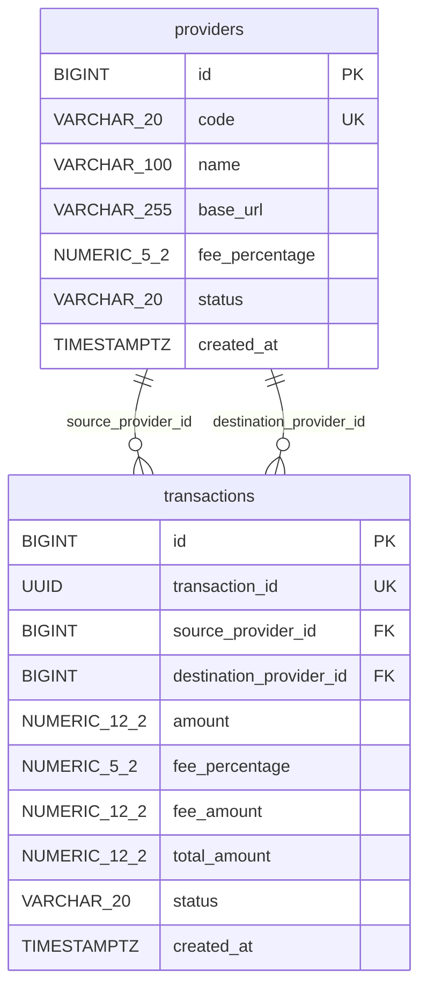

# Mini Payment Router Simulator

A small system standing between two Digital Financial Service Providers (DFSPs). It
quotes a transfer before anything moves, prices every transfer from the *destination*
provider's current fee, and records the outcome — success or failure — as a permanent
row nothing else quietly rewrites. It's built the way a real router has to be: money
handled as exact decimals, two DFSPs with genuinely incompatible wire formats hidden
behind one adapter each, and a rejected or unreachable transfer that's still a fact
worth keeping, not an error that vanishes.

**Stack**

- **Backend** — Spring Boot 4.1, Java 21, Spring Data JPA / Hibernate
- **Database** — PostgreSQL 16
- **Frontend** — React 19, Vite 8, served by Nginx
- **Testing** — JUnit 5, Mockito, `MockRestServiceServer`, Vitest, a bash smoke test
- **Containerization** — Docker, Docker Compose

---

## What it does

- **Quote** — `POST /api/quotes`: fee % and total for a transfer, priced from the
  destination provider. Nothing is sent or stored.
- **Transfer** — `POST /api/transfers`: routed to the destination DFSP over HTTP; the
  outcome is recorded either way.
- **Two dummy DFSPs, deliberately incompatible** — DFSP-A speaks decimal taka and
  `SUCCESS`/`FAILED`; DFSP-B speaks integer paisa and `ACCEPTED`/`REJECTED`. An adapter
  per DFSP hides the difference from the rest of the app.
- **Database-driven, provider-specific fees** — DFSP-A 1.00%, DFSP-B 1.50%, changeable
  with one SQL `UPDATE`, no redeploy.
- **Consistent JSON error shape** for every 4xx/5xx response.
- **File logging** to `logs/payment-router.log` — request, DFSP call, and outcome.
- **Docker Compose**: one command, five services, healthchecks, service-name networking.

Two properties are load-bearing and worth stating up front:

- **The fee always comes from the destination provider, and it's frozen onto the
  transaction the instant it's charged.** A fee changed tomorrow never rewrites what a
  transfer cost yesterday — there is no recalculation, ever.
- **Every transfer that passes validation is recorded, success or failure.** A DFSP
  that rejects it, times out, or can't be reached still leaves a row. Nothing is
  silently dropped.

---

## Architecture


- The browser talks only to `frontend`; Nginx forwards `/api/*` to `payment-router`, so
  the browser sees a single origin.
- Only `payment-router` talks to `postgres`, `dfsp-a` and `dfsp-b`. The DFSPs never talk
  to each other or to the database.
- Containers reach each other by Compose **service name** (`postgres:5432`,
  `http://dfsp-a:8081`), never by `localhost`.

**Layers inside `payment-router`**

```
Controller → Service → DfspStrategy → DfspClient (adapter) → DFSP over HTTP
                │
                └────→ Repository → PostgreSQL
```

| Package | Responsibility |
|---------|----------------|
| `controller` | HTTP endpoints; triggers `@Valid`; delegates to services |
| `service` | Business validation, quote calculation, transfer orchestration; picks the strategy matching the destination provider's code |
| `strategy` | One strategy per DFSP (pricing + which adapter to call) |
| `client` | Adapters translating to and from each DFSP's own API |
| `entity`, `repository` | JPA entities and Spring Data repositories |
| `exception` | Custom exceptions and the global error handler |
| `config` | HTTP client timeouts, CORS, provider seed data |

Full design write-up — sequence diagrams for both flows, the pattern rationale in
depth, the validation and testing matrix — is in
[docs/ARCHITECTURE.md](docs/ARCHITECTURE.md). The assignment-checklist-format README
(every required section, full request/response examples) is in
[docs/README_ASSIGNMENT.md](docs/README_ASSIGNMENT.md).

---

## Running it

### The one command

```bash
git clone <repo-url> && cd "Mini Payment Router Simulator"
docker compose up --build
```

That's the entire setup. Five containers come up — `postgres`, `dfsp-a`, `dfsp-b`,
`payment-router`, `frontend` — the router seeds its own provider rows on first boot, and:

- **http://localhost:3000** — the app
- **http://localhost:8080/api/status** — router health
- **http://localhost:8081**, **http://localhost:8082** — DFSP-A, DFSP-B directly

No local Java, Maven or Node install, no manual database setup, nothing to configure —
every value in `docker-compose.yml` has a default. If port 3000 is already taken:

```bash
FRONTEND_PORT=3001 docker compose up --build          # bash
$env:FRONTEND_PORT="3001"; docker compose up --build  # PowerShell
```

### Everyday commands

```bash
docker compose up --build           # (re)build images and start everything
docker compose down                 # stop, keep the data
docker compose down -v              # stop and wipe the database volume — a clean-slate reset
docker compose logs -f payment-router  # tail one service's logs
```

Data survives a plain `down`/`up` — Postgres writes to a named volume (`pgdata`), not
the container's own filesystem.

---

## Trying it out

1. Open **http://localhost:3000**. Providers load automatically into the two dropdowns.
2. **Quote DFSP-A → DFSP-B, amount 1000**: fee `15.00` (DFSP-B's 1.50%), total `1015.00`
   — the *destination's* fee, not the source's.
3. **Confirm the transfer** → `SUCCESS`, a transaction ID, and a row saved in Postgres.
4. **Reverse the direction**: DFSP-B → DFSP-A, same amount. The fee is now `10.00`
   (DFSP-A's 1.00%) — the destination changed, so the fee did too.
5. **Push DFSP-B over its limit** (amount `30000`) → `FAILED`, DFSP-B's own reason quoted
   back — and still saved as a row.
6. **Stop the destination DFSP** (`docker compose stop dfsp-b`) and try again → `FAILED`,
   *"Destination DFSP is unavailable"*. The router itself never crashes.
7. **Change a fee mid-flight**:
   ```sql
   UPDATE providers SET fee_percentage = 2.00 WHERE code = 'DFSP_B';
   ```
   New quotes use `2.00%` immediately. The transaction from step 3 still shows `1.50%`.

---

## App flow

```mermaid
flowchart LR
    Start([Open the app]) --> Load["Load providers<br/>GET /api/providers"]
    Load --> Form["Fill form:<br/>source, destination, amount"]

    Form --> GetQuote["Click 'Get quote'"]
    GetQuote --> ValidateQuote{"Valid request &<br/>providers OK?"}
    ValidateQuote -- No --> QuoteError["Show error banner"]
    QuoteError --> Form

    ValidateQuote -- Yes --> Calculate["Price using the<br/>DESTINATION provider's<br/>current fee"]
    Calculate --> QuoteResult["Show quote card:<br/>fee %, fee, total"]

    QuoteResult --> Confirm["Click 'Confirm transfer'"]
    Confirm --> ValidateTransfer{"Valid request &<br/>providers OK?"}
    ValidateTransfer -- No --> TransferError["Show error banner"]
    TransferError --> QuoteResult

    ValidateTransfer -- Yes --> Strategy["Select destination<br/>DFSP's strategy"]
    Strategy --> Adapter["DFSP adapter<br/>(translate + call)"]
    Adapter --> DFSPA["DFSP-A"]
    Adapter --> DFSPB["DFSP-B"]

    DFSPA --> Outcome{"DFSP response"}
    DFSPB --> Outcome

    Outcome -- Accepted --> StatusSuccess["status = SUCCESS"]
    Outcome -- Rejected --> StatusFailed["status = FAILED"]
    Outcome -- "Unreachable / timeout" --> StatusFailed

    StatusSuccess --> Save["Save transaction in PostgreSQL<br/>(pricing snapshot, ALWAYS)"]
    StatusFailed --> Save

    Save --> LogIt["Write to payment-router.log"]
    LogIt --> ShowResult["Show result card: <br/>SUCCESS or FAILED"]

    ShowResult --> NewTransfer["Click 'New transfer'"]
    NewTransfer --> Form
```



Both `SUCCESS` and `FAILED` outcomes reach `Save` — a rejected, unreachable or
timed-out transfer is still recorded, never silently dropped.

---

## Entity relationship diagram



Two independent relationships connect the same two tables — `source_provider_id` and
`destination_provider_id` both point at `providers.id`. A transaction's source and
destination may point at the *same* provider row (e.g. `DFSP_A` → `DFSP_A`). There is
no `quotes` table: a quote is a calculation, not a business record.

---

## Tests

```bash
cd backend/payment-router && ./mvnw test   # 66 tests
cd backend/dfsp-a         && ./mvnw test   # 8 tests
cd backend/dfsp-b         && ./mvnw test   # 8 tests
cd frontend               && npm test      # 5 tests
```

The router's tests run against a **real PostgreSQL** on port 5433, not an in-memory
database — `NUMERIC` precision and constraint behaviour need to be exercised as they
actually behave, the same reasoning as Testcontainers. **`PaymentApiIntegrationTest`**
mocks nothing inside the router: a real HTTP request runs through validation, strategy,
adapter and `RestClient`, into two in-process fake DFSP HTTP servers speaking their real
wire formats, and lands in Postgres.

```bash
docker compose up --build -d
bash scripts/smoke-test.sh   # 21 checks against the real Compose stack, through Nginx
```

---

## Layout

```
backend/
  payment-router/    Dockerfile; controller/ service/ strategy/ client/ entity/ repository/ exception/ config/
  dfsp-a/            Dummy DFSP-A — own Maven project, port 8081, decimal taka
  dfsp-b/            Dummy DFSP-B — deliberately different API, port 8082, integer paisa
frontend/
  src/               App.jsx, components/, api/paymentRouterApi.js
  Dockerfile, nginx.conf
docs/
  ARCHITECTURE.md        Full design doc: sequence diagrams, pattern rationale, testing matrix
  README_ASSIGNMENT.md   Assignment-checklist-format README
scripts/smoke-test.sh    Smoke test for the running Compose stack
docker-compose.yml       5 services wired together
```

Three independent Maven projects plus one React app — no shared parent, no shared code.
`payment-router`, `dfsp-a` and `dfsp-b` are meant to be three separate organisations;
sharing a build would blur that on purpose.

---

## Notable design decisions

| Decision | Why |
|---|---|
| Fee priced from the **destination** provider, not the source | Whoever receives and processes a payment sets its price — mirrors how real inter-DFSP settlement works |
| Pricing snapshot stored on every transaction | A fee changed tomorrow must never rewrite what a transfer cost yesterday |
| Every valid attempt is saved, success or failure | A rejected, timed-out or unreachable transfer is still a business event, not an error to discard |
| Database write happens *after* the DFSP call, never wrapping it | A slow or hanging DFSP must never hold a database connection open |
| Two DFSP APIs made deliberately incompatible | Gives the Adapter Pattern a genuine reason to exist — taka vs paisa, `SUCCESS`/`FAILED` vs `ACCEPTED`/`REJECTED` |
| Strategy selection is a `stream().filter()`, no factory class | Only two DFSPs; a dedicated lookup class is pure overhead. Adding DFSP-C means one new strategy + adapter bean, nothing else changes |
| Source and destination may be the same provider | A DFSP paying itself is still a valid transfer; there's no reason to special-case it |
| `spring.jpa.open-in-view=false` | Forces every database read to finish inside the service layer; a stray lazy-load reached from a controller fails loudly instead of silently |
| Nginx forwards the browser's original `Host` header | Otherwise Spring sees a mismatched Origin/Host and rejects the POST as cross-origin |
| `BigDecimal` / `NUMERIC` for every amount | Binary floating point cannot represent `15.00` exactly, and a fee is not an approximation |
| No quotes table | A quote is a calculation, not a record — nothing to persist |

---

## API

| Method | Path | Notes |
|---|---|---|
| `GET` | `/api/status` | Health check; used by the Docker healthcheck |
| `GET` | `/api/providers` | Active providers for the dropdowns (`code`, `name` only) |
| `POST` | `/api/quotes` | Priced from the destination provider; nothing stored; `200` |
| `POST` | `/api/transfers` | Priced, routed, **always** stored; `201`, with `status` (`SUCCESS`/`FAILED`) in the body |

Quote and transfer share one request body:

```json
{ "sourceProviderCode": "DFSP_A", "destinationProviderCode": "DFSP_B", "amount": 1000.00 }
```

Full request/response examples, the DFSP wire formats, and the complete error table are
in [docs/README_ASSIGNMENT.md](docs/README_ASSIGNMENT.md#13-example-api-requests-and-responses).
