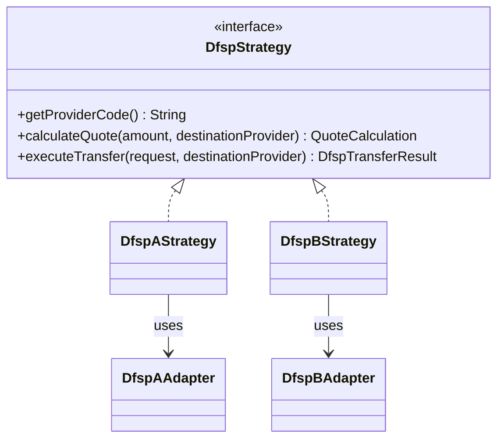
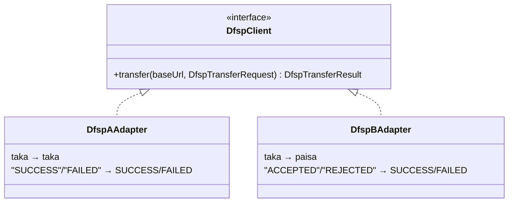
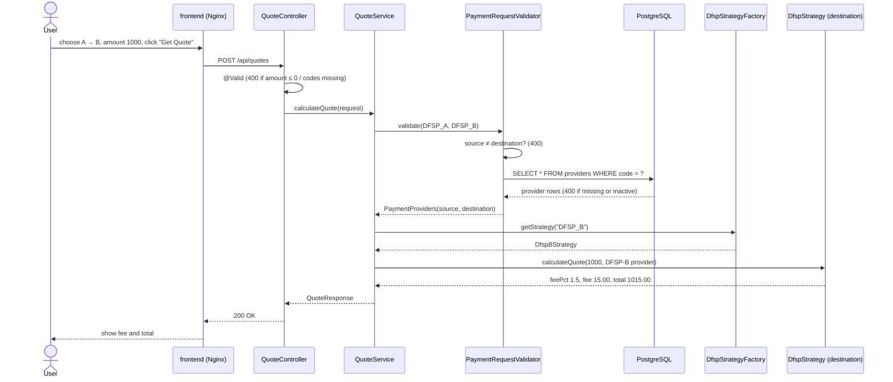
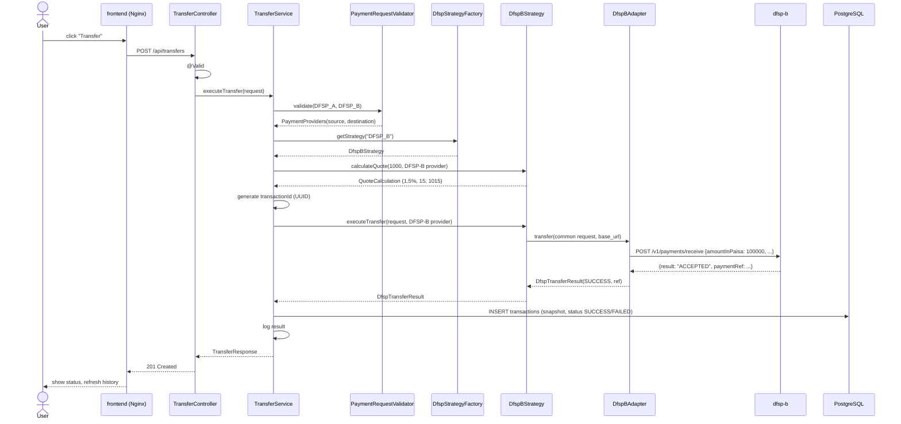
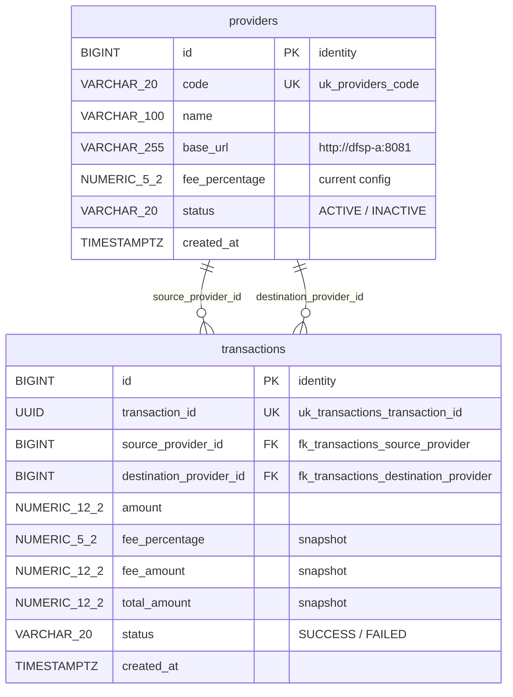

# Mini Payment Router Simulator — Architecture

> Status: **design document (Step 01)**.
> It describes the target architecture. No business logic is implemented yet.
> Values marked *planned* (ports, limits, timeouts) may be adjusted during implementation.

---

## 1. Problem Summary

A **payment router** is the middle system between **Digital Financial Service
Providers (DFSPs)**. When money moves from one DFSP to another, the router:

1. **Quotes** the transfer: how much fee is charged and what the total is.
2. **Transfers** the money: it routes the request to the destination DFSP,
   receives the result, and records it.

In this simulator:
- **DFSP-A** and **DFSP-B** are small dummy Spring Boot services.
- The router keeps the provider configuration (including fee percentage) and
  the transaction history in **PostgreSQL**.
- A **React** UI lets a user request quotes, make transfers and see each transfer's result.

**Pricing rule:** the fee is calculated from the **destination provider's**
current `fee_percentage`.

| Direction | Amount | Fee % (destination) | Fee  | Total |
|-----------|--------|---------------------|------|-------|
| A → B     | 1000   | 1.5 (DFSP-B)        | 15   | 1015  |
| B → A     | 1000   | 1.0 (DFSP-A)        | 10   | 1010  |

---

## 2. High-Level Architecture

```
 ┌──────────────┐
 │   Browser    │
 └──────┬───────┘
        │ HTTP  (http://localhost:3000)
┌───────▼───────────────────────────────────────────────────────────────┐
│                     Docker Compose default network                     │
│                                                                        │
│  ┌──────────────────┐   /api/*  (reverse proxy)                        │
│  │     frontend     │─────────────────────┐                            │
│  │  React + Nginx   │                     │                            │
│  └──────────────────┘                     ▼                            │
│                              ┌─────────────────────────┐               │
│                              │     payment-router      │               │
│                              │  Spring Boot (Java 21)  │──► logs/payment-router.log
│                              │                         │               │
│                              │ Controller → Service →  │               │
│                              │ Strategy → Adapter      │               │
│                              └───┬──────────┬──────┬───┘               │
│                     JDBC (JPA)   │   REST   │      │  REST             │
│                   ┌──────────────┘          │      │                   │
│                   ▼                         ▼      ▼                   │
│          ┌────────────────┐        ┌──────────┐  ┌──────────┐          │
│          │    postgres    │        │  dfsp-a  │  │  dfsp-b  │          │
│          │ providers,     │        │  Spring  │  │  Spring  │          │
│          │ transactions   │        │  Boot    │  │  Boot    │          │
│          └───────┬────────┘        └──────────┘  └──────────┘          │
│                  │ volume: pgdata                                      │
└──────────────────┴─────────────────────────────────────────────────────┘
```

**Communication rules**
- The browser talks **only** to `frontend`. Nginx forwards `/api/*` to `payment-router`.
- Only `payment-router` talks to `postgres`, `dfsp-a` and `dfsp-b`.
- DFSPs never talk to each other or to the database.
- Containers reach each other by **Compose service name** (`http://dfsp-a:8081`, `postgres:5432`), never by `localhost`.

---

## 3. Service Responsibilities

### 3.1 React Frontend (`frontend`)
- A form with **source provider**, **destination provider** and **amount**.
- A **Get Quote** button shows the fee percentage, fee amount and total amount.
- A **Transfer** button runs the transfer and shows SUCCESS or FAILED.
- A result card showing the recorded transaction: status badge, transaction ID, DFSP message and pricing snapshot. (A separate transaction history page is not part of the current UI.)
- It loads the provider dropdown options from the API, so it has no hard-coded provider list.
- It holds **no business logic**. Fee calculation and validation belong to the backend. (Simple UI checks are allowed for user experience only.)
- In Docker, **Nginx** serves the built static files and reverse-proxies `/api` to `payment-router:8080`. In local development the **Vite dev server** proxies `/api` to `http://localhost:8080` the same way. The browser sees one origin, so CORS is not involved.
- The router also has a narrow **CORS allow-list** (`app.cors.allowed-origins`, default `http://localhost:5173,http://localhost:4173`: `/api/**`, GET/POST, `Content-Type` only). It is used only when the frontend calls the router directly through `VITE_API_BASE_URL`.
- **A proxy must keep the browser's `Host` header** (Vite: `changeOrigin: false`; Nginx: `proxy_set_header Host $http_host`, which includes the port, unlike `$host`). Browsers send an `Origin` header on POST. If the proxy rewrites `Host` to the router's address, Spring sees Origin ≠ Host, treats the call as cross-origin, and rejects POSTs from origins outside the allow-list with 403 "Invalid CORS request".

### 3.2 Payment Router (`payment-router`) — the main backend
- Exposes the public REST API.
- **Validates** requests.
- Reads provider configuration from `providers`.
- **Calculates** quotes (fee % → fee → total).
- **Routes** transfers to the destination DFSP through the right strategy and adapter.
- **Saves** every transfer attempt, SUCCESS or FAILED, into `transactions` as a pricing snapshot.
- **Logs** important events to `logs/payment-router.log`.

### 3.3 DFSP-A (`dfsp-a`) — dummy provider
- A small, stateless Spring Boot service with **one transfer endpoint** in *its own* API format.
- Applies a simple simulated rule to **accept or reject** (planned: reject amounts above 50,000).
- Returns a reference ID and a status.
- No database, no fee calculation (the router owns pricing), no authentication. Logs go to the console.

### 3.4 DFSP-B (`dfsp-b`) — dummy provider
- Same role as DFSP-A, but with a **deliberately different API format**:
  different URL, field names, money unit (paisa) and status words.
- Planned simulated rule: reject amounts above 25,000.
- The different format is what gives the **Adapter Pattern** a real purpose.

| Aspect            | DFSP-A                                   | DFSP-B                                        |
|-------------------|------------------------------------------|-----------------------------------------------|
| Endpoint          | `POST /api/dfsp-a/transfers`             | `POST /v1/payments/receive`                   |
| Request fields    | `transactionId`, `sourceProvider`, `amount`, `fee` | `clientRef`, `senderDfsp`, `amountInPaisa`, `feeInPaisa` |
| Money unit        | Decimal taka (`1000.00`)                 | Integer paisa (`100000`)                      |
| Success response  | `{ "status": "SUCCESS", "referenceId": ... }` | `{ "result": "ACCEPTED", "paymentRef": ... }` |
| Failure response  | `{ "status": "FAILED", "message": ... }` | `{ "result": "REJECTED", "reason": ... }`     |

### 3.5 PostgreSQL (`postgres`)
- Stores the **current provider configuration** (`providers`).
- Stores the **historical transactions** (`transactions`).
- It is the router's database only. Data survives container restarts through the `pgdata` volume.

---

## 4. Payment Router Internal Structure

Layer flow:

```
Controller  →  Service  →  Strategy  →  Adapter (DfspClient)  →  Dummy DFSP (HTTP)
                  │
                  └──────→  Repository  →  PostgreSQL
```

Planned packages:

```
backend/payment-router/src/main/java/com/paymentrouter/router/
├── PaymentRouterApplication.java
├── controller/   QuoteController, TransferController,
│                 ProviderController, TransactionController
├── dto/          QuoteRequest, QuoteResponse, TransferRequest,
│                 TransferResponse, ProviderResponse, TransactionResponse, ErrorResponse
├── service/      PaymentRequestValidator, PaymentProviders, QuoteService, TransferService
├── strategy/     DfspStrategy, DfspAStrategy, DfspBStrategy,
│                 DfspStrategyFactory, QuoteCalculation
├── client/       DfspClient, DfspAAdapter, DfspBAdapter,
│                 DfspTransferRequest, DfspTransferResult
├── entity/       Provider, Transaction, ProviderStatus, TransactionStatus
├── repository/   ProviderRepository, TransactionRepository
├── exception/    custom exceptions, GlobalExceptionHandler
└── config/       HTTP client configuration
```

| Layer / Component     | Responsibility                                                            | Must NOT do                      |
|-----------------------|---------------------------------------------------------------------------|----------------------------------|
| Controller            | Receive HTTP, trigger `@Valid`, call a service, return a response         | Business rules, DB access        |
| PaymentRequestValidator | Business validation: source ≠ destination, providers exist and are ACTIVE | HTTP calls                     |
| QuoteService          | Call the validator, pick the strategy, calculate fee and total            | Save anything                    |
| TransferService       | Validate, price with the strategy, route via strategy → adapter, save the snapshot, log | Know DFSP JSON formats |
| DfspStrategy          | DFSP-specific behaviour: pricing policy and which client to use            | Build raw HTTP/JSON              |
| DfspClient (Adapter)  | Translate the common model ⇄ a DFSP's own API, make the HTTP call           | Business decisions               |
| Repository            | Read and write the database                                               | Business rules                   |

---

## 5. Design Patterns

### 5.1 Strategy Pattern — isolates DFSP-specific behaviour



- There is **one strategy per destination DFSP**.
- `calculateQuote` has **one common default implementation** in the interface:
  `fee = amount × fee_percentage / 100`, rounded to 2 decimals (`HALF_UP`),
  and `total = amount + fee`. Every DFSP currently uses the same formula, so the
  code is not duplicated. A DFSP whose pricing ever differs overrides only this method.
- `executeTransfer` is **implemented by each strategy**, which routes to its own `DfspClient`.
- `TransferService` never writes `if (code == "DFSP_A") ... else ...`. It asks for
  the strategy and calls it.

> **Honest note:** at this project's size the two strategies are small. Their value
> is a clear boundary. DFSP-specific **business** behaviour lives in the strategy;
> DFSP-specific **API** details live in the adapter. Adding DFSP-C means adding
> classes, not editing the transfer service.

### 5.2 Adapter Pattern — hides DFSP API differences



- `DfspTransferRequest` and `DfspTransferResult` are the router's **common, DFSP-neutral models**.
- Each adapter converts the common request into the DFSP's JSON, sends it to the
  provider's `base_url` (read from the `providers` table), and converts the reply back.
- Network errors (DFSP down, timeout) become a **`DfspCommunicationException`**,
  which the transfer service handles.

### 5.3 Factory — used, because lookup-by-code is genuinely needed

`DfspStrategyFactory` answers one question: *"Which strategy handles destination `DFSP_B`?"*

> **Decision (Step 13):** implemented as a *selection* factory. Spring DI already creates
> the strategy objects, so the factory does not call `new`. It indexes the injected
> strategies by provider code, fails at startup on duplicate codes, and throws when a
> provider has no strategy. `QuoteService` and `TransferService` (Step 17) both use it,
> so this selection logic is written once.

- Spring injects **all** `DfspStrategy` beans as a `List`.
- The factory builds a `Map<String, DfspStrategy>` keyed by `getProviderCode()`.
- `getStrategy(code)` returns the match, or throws an error if no strategy exists for that code.

**Why it is worth having:** without it, `QuoteService` and `TransferService`
would each need a `switch` over provider codes. That is the exact `if/else` the
Strategy Pattern is meant to remove.

**Where we do NOT use a factory:** adapters. Each strategy always uses the same
adapter, so Spring injects the adapter directly into the strategy constructor.
A factory there would add a class with no benefit.

---

## 6. Public API (payment-router)

| Method | Path                | Purpose                                              |
|--------|---------------------|------------------------------------------------------|
| POST   | `/api/quotes`       | Calculate a quote (nothing is saved)                 |
| POST   | `/api/transfers`    | Execute a transfer (a transaction is saved)          |
| GET    | `/api/providers`    | List providers (UI dropdowns)                        |
| GET    | `/api/transactions` | *Not implemented:* planned history listing (not used by the current UI) |

### 6.1 Quote
`POST /api/quotes`
```json
{ "sourceProviderCode": "DFSP_A", "destinationProviderCode": "DFSP_B", "amount": 1000.00 }
```
`200 OK`
```json
{
  "sourceProviderCode": "DFSP_A",
  "destinationProviderCode": "DFSP_B",
  "amount": 1000.00,
  "feePercentage": 1.50,
  "feeAmount": 15.00,
  "totalAmount": 1015.00
}
```

### 6.2 Transfer
`POST /api/transfers` has the same request body as a quote.

`201 Created`. A transaction row is created for SUCCESS and for FAILED; the business outcome is in `status`.
```json
{
  "transactionId": "3f6e2c1a-8b0d-4c5e-9a4f-1d2b3c4d5e6f",
  "sourceProviderCode": "DFSP_A",
  "destinationProviderCode": "DFSP_B",
  "amount": 1000.00,
  "feePercentage": 1.50,
  "feeAmount": 15.00,
  "totalAmount": 1015.00,
  "status": "SUCCESS",
  "message": "Accepted by DFSP-B (ref B-PAY-000123)",
  "createdAt": "2026-09-14T10:01:12Z"
}
```

### 6.3 Error response (all endpoints)
```json
{
  "timestamp": "2026-09-14T10:01:12Z",
  "status": 400,
  "error": "Bad Request",
  "message": "Source and destination provider cannot be the same",
  "fieldErrors": {}
}
```

| HTTP | When                                                                    |
|------|-------------------------------------------------------------------------|
| 400  | Field validation failed, malformed JSON, same provider, provider not found or inactive |
| 404  | No endpoint for the URL                                                 |
| 405  | HTTP method not supported by the endpoint                               |
| 415  | Body not sent as `application/json`                                     |
| 500  | Unexpected server error (details only in the log)                       |

All of these are produced by `GlobalExceptionHandler` with the same JSON shape.
A DFSP timeout gets its own FAILED message: "Destination DFSP did not respond in time".

DFSP rejection or DFSP unavailability is **not** an HTTP error for the client.
It is saved and returned as a `FAILED` transaction.

---

## 7. Validation

| Rule                                        | Where                                     | Mechanism                          |
|---------------------------------------------|-------------------------------------------|------------------------------------|
| Amount is required and greater than zero    | Request DTO                               | `@NotNull`, `@Positive` + `@Valid` |
| Amount has at most 2 decimal places         | Request DTO                               | `@Digits(integer = 10, fraction = 2)` |
| Source provider is required                 | Request DTO                               | `@NotBlank`                        |
| Destination provider is required            | Request DTO                               | `@NotBlank`                        |
| Source and destination are not the same     | `PaymentRequestValidator`                 | Business check → 400               |
| Provider exists and is ACTIVE               | `PaymentRequestValidator`                 | DB lookup → 400                    |

Request validation runs first (`@Valid`), so an invalid request never reaches a service.
`GlobalExceptionHandler` (`@RestControllerAdvice`) converts `MethodArgumentNotValidException`
(field errors) and `InvalidPaymentRequestException` (business rules) into the error JSON above.
Quote and transfer share the same business checks through `PaymentRequestValidator`.

---

## 8. Runtime Flows

### 8.1 Quote Flow



Request → validate → find destination provider → read fee percentage →
calculate fee → calculate total → return quote. **No DFSP call and no database write.**

### 8.2 Transfer Flow



Step by step:
1. **Validate**: DTO rules, source ≠ destination, both providers exist and are ACTIVE.
2. **Determine the destination provider** and **calculate** fee % / fee / total with the *current* configuration. Pricing uses the destination strategy's `calculateQuote`, the same method quotes use, so the quote and transfer rules are the same code.
3. **Generate** a unique `transactionId` before calling the DFSP, so the DFSP receives it as a reference.
4. **Route**: `DfspStrategyFactory` → destination strategy → its adapter → HTTP call to the DFSP's `base_url`.
5. **Receive the response**: the adapter maps it to `SUCCESS` or `FAILED`. If the DFSP is unreachable or times out, the service catches `DfspCommunicationException` and the status is `FAILED`.
6. **Save** one `transactions` row with the pricing snapshot and status.
7. **Log** the result: INFO for SUCCESS, WARN for FAILED, ERROR for exceptions.
8. **Return** the response.

**Deliberate simplifications**
- The database insert is **not** wrapped around the HTTP call. A DB transaction is never held open while waiting for a remote service.
- If the router crashed *after* the DFSP accepted and *before* saving, that record would be lost. A production system would save a `PENDING` row first and reconcile later. This is out of scope for the simulator.
- Quotes are not stored, so a transfer **recalculates** with the fee percentage current at transfer time. The saved snapshot records exactly what was charged.

---

## 9. Database Design



**Seed data.** `ProviderDataInitializer` (a Spring `ApplicationRunner`) inserts
each provider at startup **only if its code does not exist yet**. Existing rows
are never overwritten, so a fee changed later in the database survives restarts.

| code   | name   | base_url (local default / Docker)              | fee_percentage | status |
|--------|--------|------------------------------------------------|----------------|--------|
| DFSP_A | DFSP-A | `http://localhost:8081` / `http://dfsp-a:8081` | 1.00           | ACTIVE |
| DFSP_B | DFSP-B | `http://localhost:8082` / `http://dfsp-b:8082` | 1.50           | ACTIVE |

The base URL comes from `DFSP_A_BASE_URL` / `DFSP_B_BASE_URL`, falling back to
the local default. Fee percentages are never hard-coded in calculation logic;
quotes and transfers always read them from `providers`.

**Responsibilities**
- `providers` = **current configuration**. It can change, for example DFSP-B moving from 1.5% to 2%.
- `transactions` = **history**. Once written, a row's pricing is never recalculated.

**Pricing snapshot.** `fee_percentage`, `fee_amount` and `total_amount` are copied
into the transaction when it is created. If DFSP-B later changes to 2%, an old
A → B transaction for 1000 still shows **1.5% / 15 / 1015**. Reading the fee from
`providers` for old rows would silently rewrite history.

**Two IDs in `transactions`**
- `id` (BIGINT identity): the internal primary key, small and fast, used for joins and never exposed.
- `transaction_id` (UUID): the public business identifier returned by the API and sent to DFSPs. It cannot be guessed and does not reveal how many transactions exist.

**Other decisions**
- Money is stored as `NUMERIC` in the database and handled as `BigDecimal` in Java. `double` is never used, because it has rounding errors.
- Two foreign keys point to the same table. JPA maps them as two `@ManyToOne` fields (`sourceProvider`, `destinationProvider`).
- There is no quotes table: quotes are cheap to recalculate and are not a business record.

---

## 10. Logging

- Uses Spring Boot's default **SLF4J + Logback**. File output is enabled with `logging.file.name`.
- `logging.file.name=logs/payment-router.log` is relative to the working directory: `backend/payment-router/logs/payment-router.log` when run locally, `/app/logs/payment-router.log` inside the container (bind-mounted to `./logs` on the host).
- Logs go to both the console and the file. The file rolls at 10 MB, and 7 days of history are kept.
- Test runs write to `target/test-logs/payment-router-test.log` (Surefire system property), so they never mix with application logs.
- DFSP adapters log the DFSP-specific request and response (`DFSP-B request: POST ... DfspBPaymentRequest[...]`).

| Event                          | Level | Example content                                   |
|--------------------------------|-------|---------------------------------------------------|
| Quote request                  | INFO  | source, destination, amount                       |
| Transfer request               | INFO  | source, destination, amount, transactionId        |
| DFSP request                   | INFO  | provider, URL, transactionId                      |
| DFSP response                  | INFO  | provider, mapped status, reference/message        |
| Successful transfer            | INFO  | transactionId, fee, total                         |
| Failed transfer                | WARN  | transactionId, reason                             |
| Validation failure             | WARN  | message                                           |
| Exceptions (DFSP down, others) | ERROR | message + stack trace                             |

Dummy DFSPs log to the console only (`docker compose logs dfsp-a`). The
assignment's file-logging requirement is met in the main backend, which keeps
the DFSPs minimal.

---

## 11. Docker Service Architecture

| Service          | Image / build                         | Port (host:container) | Depends on                 |
|------------------|---------------------------------------|-----------------------|----------------------------|
| `frontend`       | `node:22-alpine` build → `nginx:1.27-alpine` | `${FRONTEND_PORT:-3000}:80` | payment-router (healthy) |
| `payment-router` | `maven:3.9-eclipse-temurin-21` build → `eclipse-temurin:21-jre-alpine` | `8080:8080` | postgres (healthy), dfsp-a, dfsp-b |
| `dfsp-a`         | Maven build → `eclipse-temurin:21-jre-alpine` | `8081:8081`       | –                          |
| `dfsp-b`         | Maven build → `eclipse-temurin:21-jre-alpine` | `8082:8082`       | –                          |
| `postgres`       | `postgres:16-alpine`                  | not published         | –                          |

- **Multi-stage Dockerfiles.** Build tools (Maven, Node) stay in the build stage; the final image only contains what is needed to run.
- **Healthcheck on postgres** (`pg_isready`). `payment-router` waits for `condition: service_healthy`, so it does not start before the DB accepts connections.
- **Healthcheck on payment-router** (`wget http://localhost:8080/api/status` inside its own container). `frontend` waits until the router is healthy.
- **Tests are not run inside the image build** (`-DskipTests`), because the router's tests need PostgreSQL. Run them with `./mvnw test` before building.
- **Nginx** (`frontend/nginx.conf`) serves the React build and proxies `/api/` to `http://payment-router:8080` with `Host $http_host`.
- **`.env.example`** lists the optional overrides (`POSTGRES_DB`, `POSTGRES_USER`, `POSTGRES_PASSWORD`, `FRONTEND_PORT`). Every value has a default in `docker-compose.yml`.
- **Named volume `pgdata`** keeps database data across restarts.
- **Bind mount `./logs:/app/logs`** makes the log file visible on the host.
- **Environment variables** configure the DB connection (`SPRING_DATASOURCE_URL=jdbc:postgresql://postgres:5432/payment_router`, username, password).
- DFSP addresses come from `providers.base_url`. In Docker they are seeded as service names through `DFSP_A_BASE_URL=http://dfsp-a:8081` and `DFSP_B_BASE_URL=http://dfsp-b:8082`.
- Start everything with `docker compose up --build`, then open `http://localhost:3000`.

Planned repository layout:

```
Mini Payment Router Simulator/
├── frontend/                 React app, Dockerfile, nginx.conf
├── backend/
│   ├── payment-router/       Main Spring Boot service (Maven project)
│   ├── dfsp-a/               Dummy DFSP-A (Maven project)
│   └── dfsp-b/               Dummy DFSP-B (Maven project)
├── docs/ARCHITECTURE.md
├── logs/                     Generated at runtime (git-ignored)
├── docker-compose.yml
└── README.md
```

---

## 12. Why This Architecture Fits the Assignment

| Assignment requirement              | How the architecture covers it                                     |
|-------------------------------------|---------------------------------------------------------------------|
| Quote API between dummy DFSPs       | `POST /api/quotes`, priced from the destination provider            |
| Transfer API between dummy DFSPs    | `POST /api/transfers` routed to a real, separate DFSP service        |
| Basic validation                    | Bean Validation + two business checks + global error handler        |
| Logging to file                     | Logback file appender → `logs/payment-router.log`                   |
| Docker multi-service setup          | 5 Compose services on one network, communicating by service name    |
| Frontend + backend                  | React (Nginx) + Spring Boot                                         |
| Explainable design                  | Layered structure + Strategy, Adapter, and one justified Factory    |

## 13. Intentionally Not Included

| Not included                                   | Reason                                                          |
|------------------------------------------------|-----------------------------------------------------------------|
| Authentication, users, JWT, Spring Security    | Not part of payment routing; explicitly excluded               |
| Quotes table                                   | Quotes are recalculable, not business records                   |
| Kafka / queues, Redis, Kubernetes              | Synchronous REST between 3 services is enough                   |
| DFSP databases, balances, accounts             | DFSPs are simulators; a simple accept/reject rule is enough     |
| Retries, circuit breakers, reconciliation      | Production resilience concerns, beyond a fresher assessment     |
| API gateway / service discovery                | Nginx proxy + Compose DNS already solve routing                 |
| Multi-module Maven parent                       | Independent small projects are easier to build and explain      |
