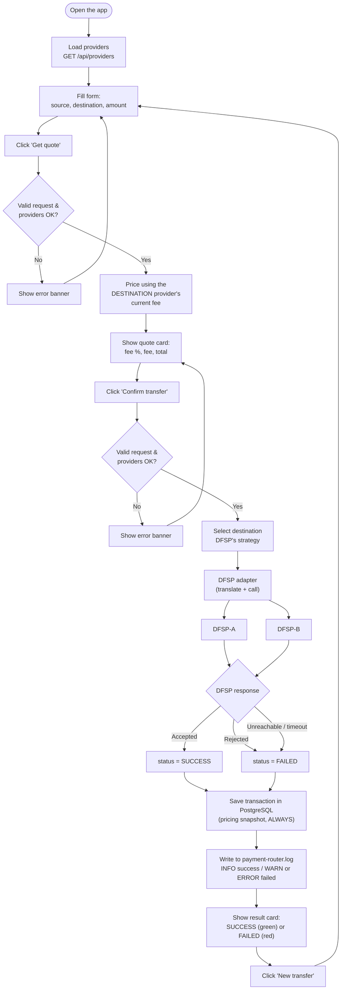
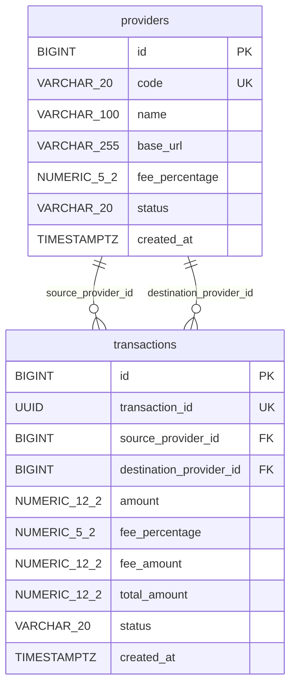

# Mini Payment Router Simulator — Full Reference

> This is the exhaustive, assignment-format version of the README (every section the
> assignment brief asked for, in order, with full request/response examples). For a
> shorter, interview-friendly overview, see [../README.md](../README.md).

A small multi-service payment router. It quotes and executes transfers between two dummy
Digital Financial Service Providers (DFSPs), applies provider-specific fees, records every
transfer in PostgreSQL, logs to a file, and runs with a React UI in one Docker Compose command.

```bash
docker compose up --build      # then open http://localhost:3000
```

## Contents

1. [Project overview](#1-project-overview)
2. [Problem statement](#2-problem-statement)
3. [Features](#3-features)
4. [Architecture](#4-architecture)
5. [Technology stack](#5-technology-stack)
6. [API endpoints](#6-api-endpoints)
7. [Quote flow](#7-quote-flow)
8. [Transfer flow](#8-transfer-flow)
9. [Database design](#9-database-design)
10. [Design patterns used](#10-design-patterns-used)
11. [Docker setup](#11-docker-setup)
12. [How to run](#12-how-to-run)
13. [Example API requests and responses](#13-example-api-requests-and-responses)
14. [Example provider fees](#14-example-provider-fees)
15. [Error handling](#15-error-handling)
16. [Logging](#16-logging)
17. [Testing](#17-testing)
18. [Project limitations](#18-project-limitations)
19. [Future improvements](#19-future-improvements)

More detail, including sequence and class diagrams, is in [docs/ARCHITECTURE.md](docs/ARCHITECTURE.md).

---

## 1. Project overview

The project has five services:

| Service | What it is |
|---------|------------|
| `frontend` | React single-page app served by Nginx. Choose providers and amount, get a quote, confirm the transfer, see the result. |
| `payment-router` | The main Spring Boot backend. Validates requests, prices them, routes transfers to the destination DFSP, stores transactions and writes the log file. |
| `dfsp-a` | Dummy DFSP with its own API format (decimal taka). |
| `dfsp-b` | Dummy DFSP with a deliberately different API format (integer paisa, different field names and status words). |
| `postgres` | PostgreSQL database with two tables: `providers` and `transactions`. |

## 2. Problem statement

A payment router sits between DFSPs. When money moves from one provider to another, the router must:

1. **Quote** the transfer: tell the user the fee and the total before anything is sent.
2. **Transfer** the money: send the request to the destination provider, receive its decision, and record the outcome.

Requirements covered by this project:

- Quote and transfer APIs between two dummy DFSPs.
- Provider-specific fees: the **destination** provider's fee percentage is applied.
- Basic validation of requests.
- Logging to a file.
- A frontend and a backend, running as a Docker multi-service setup.

## 3. Features

- **Quote** (`POST /api/quotes`): fee percentage, fee amount and total. Nothing is sent or stored.
- **Transfer** (`POST /api/transfers`): routed to the destination DFSP over HTTP; the result (`SUCCESS` or `FAILED`) is stored.
- **Provider-specific fees** read from the database (DFSP-A 1.00%, DFSP-B 1.50%).
- **Pricing snapshot**: each transaction stores the fee percentage, fee and total used at that moment, so history never changes when a fee changes.
- **Two different DFSP APIs** hidden behind adapters.
- **Validation**: required fields, positive amount, at most 2 decimal places, existing and active providers. A source and destination provider may be the same DFSP.
- **Consistent error JSON** for every error.
- **DFSP failure handling**: rejection, unreachable DFSP and timeout become a stored `FAILED` transaction, not a server error.
- **File logging** to `logs/payment-router.log` with request, DFSP call and outcome.
- **React UI** with loading states, field errors, quote summary and result card.
- **Docker Compose**: one command starts all five services, with healthchecks, a data volume and service-name networking.
- **Automated tests**: backend unit, contract and integration tests, frontend tests, and a Docker smoke test.

## 4. Architecture

```
 Browser ──► http://localhost:3000
                   │
┌──────────────────┼────────────────── Docker Compose network ───────────────────────────┐
│                  ▼                                                                      │
│   ┌──────────────────────┐   /api/*  → http://payment-router:8080                       │
│   │ frontend             │───────────────────────┐                                      │
│   │ React build + Nginx  │                       ▼                                      │
│   └──────────────────────┘        ┌─────────────────────────────┐                       │
│                                   │ payment-router (Spring Boot)│──► logs/payment-router.log
│                                   │ Controller → Service →      │                       │
│                                   │ Strategy → Adapter          │                       │
│                                   └───┬─────────────┬───────┬───┘                       │
│                    JDBC (JPA)         │  REST       │       │ REST                      │
│                                       ▼             ▼       ▼                           │
│                         ┌──────────────────┐ ┌──────────┐ ┌──────────┐                  │
│                         │ postgres         │ │ dfsp-a   │ │ dfsp-b   │                  │
│                         │ providers,       │ │ :8081    │ │ :8082    │                  │
│                         │ transactions     │ └──────────┘ └──────────┘                  │
│                         └────────┬─────────┘                                            │
└──────────────────────────────────┼──────────────────────────────────────────────────────┘
                                   ▼
                          volume: pgdata
```

**Communication rules**

- The browser talks only to `frontend`. Nginx forwards `/api/*` to `payment-router`, so the browser sees a single origin.
- Only `payment-router` talks to `postgres`, `dfsp-a` and `dfsp-b`. The DFSPs never talk to each other or to the database.
- Containers reach each other by Compose service name (`postgres:5432`, `http://dfsp-a:8081`), never by `localhost`.

**Layers inside `payment-router`**

```
Controller → Service → DfspStrategy → DfspClient (adapter) → DFSP over HTTP
                │
                └────→ Repository → PostgreSQL
```

| Package | Responsibility |
|---------|----------------|
| `controller` | HTTP endpoints; triggers `@Valid`; delegates to services |
| `dto` | Request and response records |
| `service` | Business validation, quote calculation, transfer orchestration; also picks the strategy matching the destination provider's code |
| `strategy` | One strategy per DFSP |
| `client` | Adapters that translate to and from each DFSP's API |
| `entity`, `repository` | JPA entities and Spring Data repositories |
| `exception` | Custom exceptions and the global error handler |
| `config` | HTTP client with timeouts, CORS, provider seed data |

**Repository layout**

```
├── frontend/                 React app, Dockerfile, nginx.conf
├── backend/
│   ├── payment-router/       Main Spring Boot service (Maven)
│   ├── dfsp-a/               Dummy DFSP-A (Maven)
│   └── dfsp-b/               Dummy DFSP-B (Maven)
├── docs/ARCHITECTURE.md      Detailed architecture and diagrams
├── scripts/smoke-test.sh     Smoke test for the running Compose stack
├── docker-compose.yml
└── .env.example              Optional Compose overrides
```

**Request flow** (quote, then a confirmed transfer, both directions of a DFSP call, both outcomes)



Both `SUCCESS` and `FAILED` outcomes reach `Save` — a rejected, unreachable or timed-out transfer is still recorded, never silently dropped.

## 5. Technology stack

| Area | Technology |
|------|------------|
| Backend | Java 21, Spring Boot 4.1 (Spring MVC, Bean Validation), Maven Wrapper |
| Persistence | PostgreSQL 16, Spring Data JPA, Hibernate |
| DFSP communication | Spring `RestClient` with connect and read timeouts |
| Frontend | React 19, Vite 8 |
| Web server | Nginx 1.27 (static files and `/api` reverse proxy) |
| Logging | SLF4J with Logback (console and rolling file) |
| Testing | JUnit, Mockito, bash + curl smoke test |
| Containers | Docker multi-stage builds, Docker Compose |

## 6. API endpoints

### Payment Router (public API)

Base URL: `http://localhost:8080`, or through the UI's proxy at `http://localhost:3000`.

| Method | Path | Description | Success |
|--------|------|-------------|---------|
| GET | `/api/status` | Service status (used by the Docker healthcheck) | 200 |
| GET | `/api/providers` | Active providers for the dropdowns (`code`, `name` only) | 200 |
| POST | `/api/quotes` | Calculate fee and total; nothing is stored | 200 |
| POST | `/api/transfers` | Execute a transfer; the transaction is stored | 201 (status `SUCCESS` or `FAILED` in the body) |

Quote and transfer use the same request body:

```json
{ "sourceProviderCode": "DFSP_A", "destinationProviderCode": "DFSP_B", "amount": 1000.00 }
```

### Dummy DFSP APIs (called only by the router)

| | DFSP-A (`:8081`) | DFSP-B (`:8082`) |
|--|------------------|------------------|
| Endpoint | `POST /api/dfsp-a/transfers` | `POST /v1/payments/receive` |
| Request | `transactionId`, `sourceProvider`, `amount`, `fee` | `clientRef`, `senderDfsp`, `amountInPaisa`, `feeInPaisa` |
| Money unit | Decimal taka (`1000.00`) | Integer paisa (`100000`) |
| Response | `{"status":"SUCCESS"\|"FAILED","referenceId":"A-TXN-…","message":"…"}` | `{"result":"ACCEPTED"\|"REJECTED","paymentRef":"B-PAY-…","reason":"…"}` |
| Simulated rule | Rejects amounts above 50,000.00 taka | Rejects amounts above 2,500,000 paisa (25,000.00 taka) |

## 7. Quote flow

1. The UI sends `POST /api/quotes`.
2. `@Valid` checks the fields; failures return 400 with `fieldErrors`.
3. `PaymentRequestValidator` checks that both providers exist and are `ACTIVE` (source and destination may be the same provider).
4. The service finds the strategy whose provider code matches the **destination** provider (a simple search through the two injected strategies).
5. The strategy calculates the price from the destination provider's `fee_percentage` in the database:
   `fee = amount × fee% / 100` (2 decimal places, `HALF_UP`), `total = amount + fee`.
6. The router returns the quote. **No DFSP is called and nothing is stored.**

## 8. Transfer flow

1. The user confirms the quote; the UI sends `POST /api/transfers`.
2. Field validation and business validation run exactly as for a quote.
3. The destination strategy prices the transfer with the **current** fee (the same code as the quote).
4. A `transactionId` (UUID) is generated, so the DFSP receives it as a reference.
5. The strategy calls its adapter, which converts the request to the DFSP's format and sends it to the provider's `base_url` from the database.
6. The adapter maps the DFSP's answer to the router's common result:
   - DFSP-A `SUCCESS` / DFSP-B `ACCEPTED` → `SUCCESS`
   - DFSP-A `FAILED` / DFSP-B `REJECTED` → `FAILED`
   - unreachable, timeout, HTTP error or unreadable response → `FAILED` with a clear message
7. One row is saved in `transactions` with the pricing snapshot and the status.
8. The result is logged (INFO for success, WARN for failure, ERROR with stack trace for communication errors) and returned with HTTP 201.

The database write happens after the DFSP call, so no database transaction is held open while waiting for a remote service.

## 9. Database design

Exactly two tables. Hibernate creates them from the JPA entities.

**`providers`**: the current provider configuration.

| Column | Type | Notes |
|--------|------|-------|
| `id` | BIGINT identity | Primary key |
| `code` | VARCHAR(20) | Unique (`uk_providers_code`), e.g. `DFSP_A` |
| `name` | VARCHAR(100) | Display name, e.g. `DFSP-A` |
| `base_url` | VARCHAR(255) | Where the router calls the DFSP, e.g. `http://dfsp-a:8081` |
| `fee_percentage` | NUMERIC(5,2) | Current fee, e.g. `1.50` |
| `status` | VARCHAR(20) | `ACTIVE` or `INACTIVE` |
| `created_at` | TIMESTAMP WITH TIME ZONE | Set on insert |

**`transactions`**: the transfer history.

| Column | Type | Notes |
|--------|------|-------|
| `id` | BIGINT identity | Internal primary key |
| `transaction_id` | UUID | Public identifier, unique (`uk_transactions_transaction_id`) |
| `source_provider_id` | BIGINT | FK → `providers.id` |
| `destination_provider_id` | BIGINT | FK → `providers.id` |
| `amount` | NUMERIC(12,2) | Amount sent |
| `fee_percentage` | NUMERIC(5,2) | Snapshot of the fee used |
| `fee_amount` | NUMERIC(12,2) | Snapshot |
| `total_amount` | NUMERIC(12,2) | Snapshot |
| `status` | VARCHAR(20) | `SUCCESS` or `FAILED` |
| `created_at` | TIMESTAMP WITH TIME ZONE | Set on insert |



Two independent relationships connect the same two tables: `source_provider_id` and `destination_provider_id` both point at `providers.id`. A transaction's source and destination may point at the *same* provider row (e.g. `DFSP_A` → `DFSP_A`).

Key decisions:

- **Pricing snapshot.** If DFSP-B's fee changes from 1.50% to 2.00%, an earlier A → B transfer of 1000 still shows 1.50% / 15.00 / 1015.00. History is never recalculated.
- **No quotes table.** A quote is a calculation, not a business record.
- **Money** is `NUMERIC` in the database and `BigDecimal` in Java; `double` is never used.
- **Seed data.** On startup, `ProviderDataInitializer` inserts DFSP-A and DFSP-B **only if they do not exist**. Initial values come from `application.properties` (`dfsp.*.base-url`, `dfsp.*.fee-percentage`). A fee changed later in the database is kept across restarts.

## 10. Design patterns used

| Pattern | Where | Why |
|---------|-------|-----|
| **Strategy** | `DfspStrategy`, `DfspAStrategy`, `DfspBStrategy` | DFSP-specific behaviour (pricing and which adapter to call) lives in one class per DFSP. Services never branch on provider codes. A shared default pricing rule avoids duplicated fee code; a DFSP with different pricing can override it. |
| **Adapter** | `DfspClient`, `DfspAAdapter`, `DfspBAdapter` | The two DFSPs have different URLs, field names, money units and status words. Adapters translate the router's common `DfspTransferRequest` / `DfspTransferResult` to and from each API, so nothing outside the adapters knows these details. |
| **Layered architecture** | controller → service → repository | Each layer has one responsibility and can be tested on its own. |
| **Dependency injection** | Constructor injection everywhere | Loose coupling; tests pass mocks or fakes through constructors. |

Spring injects every `DfspStrategy` bean into `QuoteService` and `TransferService` as a `List<DfspStrategy>`. Each service picks the one whose `getProviderCode()` matches the destination provider with a short `stream().filter(...).findFirst()` — no separate factory or lookup class, since a list of two is simplest searched directly. Adding a DFSP-C means adding a strategy, an adapter and a `providers` row. The quote and transfer services do not change.

No factory is used anywhere in this project: adapters are wired directly into their strategy's constructor (a fixed 1:1 pairing), and strategies are selected with the small in-service lookup described above.

## 11. Docker setup

| Service | Image / build | Host port | Starts after |
|---------|---------------|-----------|--------------|
| `frontend` | `node:22-alpine` build → `nginx:1.27-alpine` | `3000` (`FRONTEND_PORT`) | `payment-router` is healthy |
| `payment-router` | `maven:3.9-eclipse-temurin-21` build → `eclipse-temurin:21-jre-alpine` | `8080` | `postgres` is healthy; `dfsp-a`, `dfsp-b` started |
| `dfsp-a` | Maven build → `eclipse-temurin:21-jre-alpine` | `8081` | – |
| `dfsp-b` | Maven build → `eclipse-temurin:21-jre-alpine` | `8082` | – |
| `postgres` | `postgres:16-alpine` | not published | – |

- **Multi-stage builds**: Maven and Node exist only in the build stage; runtime images contain just the JRE and jar, or Nginx and static files.
- **Networking**: all services share the Compose network and use service names. `payment-router` gets `SPRING_DATASOURCE_URL=jdbc:postgresql://postgres:5432/payment_router`, `DFSP_A_BASE_URL=http://dfsp-a:8081` and `DFSP_B_BASE_URL=http://dfsp-b:8082`.
- **Healthchecks**: `pg_isready` for PostgreSQL; `GET /api/status` for the router.
- **Named volume `pgdata`**: database data survives `docker compose down`.
- **Bind mount `./logs:/app/logs`**: the router's log file appears in `logs/` on the host.
- **Nginx** serves the React build, falls back to `index.html` for client routes, and proxies `/api/` to the router while keeping the browser's `Host` header.
- **Overrides**: copy `.env.example` to `.env` to change `POSTGRES_DB`, `POSTGRES_USER`, `POSTGRES_PASSWORD` or `FRONTEND_PORT`. Every value has a default.
- Tests are not run during the image build, because the router's tests need PostgreSQL. Run them as described in [Testing](#17-testing).

## 12. How to run

### Prerequisites

- **Docker** with Docker Compose v2. This is enough for option A.
- For option B also: **Java 21** and **Node.js 20.19+ or 22.12+**. Maven is not needed; each backend includes the Maven Wrapper.

### Option A: Docker Compose (recommended)

```bash
docker compose up --build
```

Open **http://localhost:3000**. The first build downloads dependencies and takes a few minutes.

| URL | Service |
|-----|---------|
| http://localhost:3000 | Web UI |
| http://localhost:8080/api/status | Payment Router |
| http://localhost:8081, http://localhost:8082 | DFSP-A, DFSP-B (direct access for testing) |

If port 3000 is already in use, choose another port:

```bash
FRONTEND_PORT=3001 docker compose up --build          # bash
$env:FRONTEND_PORT="3001"; docker compose up --build  # PowerShell
```

Stop the stack:

```bash
docker compose down        # keeps the database volume
docker compose down -v     # also deletes all stored data
```

### Option B: Run the services locally

1. Start PostgreSQL on port 5433. This database is separate from the Compose database.

   ```bash
   docker run -d --name payment-router-postgres-dev -p 5433:5432 \
     -e POSTGRES_DB=payment_router -e POSTGRES_USER=router -e POSTGRES_PASSWORD=router \
     postgres:16-alpine
   ```

2. Start the three backends, each in its own terminal (`mvnw.cmd` on Windows):

   ```bash
   cd backend/dfsp-a         && ./mvnw spring-boot:run   # :8081
   cd backend/dfsp-b         && ./mvnw spring-boot:run   # :8082
   cd backend/payment-router && ./mvnw spring-boot:run   # :8080
   ```

3. Start the frontend:

   ```bash
   cd frontend
   npm install
   npm run dev    # http://localhost:5173, /api is proxied to http://localhost:8080
   ```

The local log file is written to `backend/payment-router/logs/payment-router.log`.

## 13. Example API requests and responses

The examples call the router on port 8080. The same requests work through the UI proxy at `http://localhost:3000`.

**List providers**

```bash
curl http://localhost:8080/api/providers
```
```json
[{"code":"DFSP_A","name":"DFSP-A"},{"code":"DFSP_B","name":"DFSP-B"}]
```

**Quote A → B**

```bash
curl -X POST http://localhost:8080/api/quotes -H "Content-Type: application/json" \
  -d '{"sourceProviderCode":"DFSP_A","destinationProviderCode":"DFSP_B","amount":1000}'
```
```json
{
  "sourceProviderCode": "DFSP_A",
  "destinationProviderCode": "DFSP_B",
  "amount": 1000.00,
  "feePercentage": 1.50,
  "feeAmount": 15.00,
  "totalAmount": 1015.00
}
```

**Transfer A → B (accepted by DFSP-B)**: HTTP 201

```bash
curl -X POST http://localhost:8080/api/transfers -H "Content-Type: application/json" \
  -d '{"sourceProviderCode":"DFSP_A","destinationProviderCode":"DFSP_B","amount":1000}'
```
```json
{
  "transactionId": "85e1680c-0e3a-423c-89d8-fdcdbceb06f8",
  "sourceProviderCode": "DFSP_A",
  "destinationProviderCode": "DFSP_B",
  "amount": 1000.00,
  "feePercentage": 1.50,
  "feeAmount": 15.00,
  "totalAmount": 1015.00,
  "status": "SUCCESS",
  "message": "ACCEPTED (ref B-PAY-8E5B439A)",
  "createdAt": "2026-09-15T05:55:39.412Z"
}
```

**Transfer B → A**: DFSP-A's fee applies

```json
{ "...": "...", "feePercentage": 1.00, "feeAmount": 10.00, "totalAmount": 1010.00,
  "status": "SUCCESS", "message": "Transfer completed (ref A-TXN-4854902E)" }
```

**Transfer rejected by the DFSP** (A → B, amount 30000): HTTP 201, stored as `FAILED`

```json
{ "...": "...", "status": "FAILED",
  "message": "Amount exceeds DFSP-B limit of 2500000 paisa (ref B-PAY-6872A857)" }
```

**Destination DFSP down** (for example `docker compose stop dfsp-b`): HTTP 201, stored as `FAILED`

```json
{ "...": "...", "status": "FAILED", "message": "Destination DFSP is unavailable" }
```

If the DFSP does not answer within the timeout, the message is `"Destination DFSP did not respond in time"`.

**Validation error**: HTTP 400

```bash
curl -X POST http://localhost:8080/api/quotes -H "Content-Type: application/json" \
  -d '{"sourceProviderCode":"DFSP_A","destinationProviderCode":"DFSP_B","amount":0}'
```
```json
{
  "timestamp": "2026-09-15T05:56:02.118Z",
  "status": 400,
  "error": "Bad Request",
  "message": "Request validation failed",
  "fieldErrors": { "amount": "amount must be greater than zero" }
}
```

**Business rule errors**: HTTP 400

```json
{ "status": 400, "error": "Bad Request", "message": "Provider not found: DFSP_X", "fieldErrors": {} }
{ "status": 400, "error": "Bad Request", "message": "Provider is not active: DFSP_A", "fieldErrors": {} }
```

A source and destination provider are allowed to be the same DFSP; a transfer like DFSP_A → DFSP_A is priced and routed like any other transfer, using DFSP-A's own strategy and adapter.

## 14. Example provider fees

| Provider | Fee percentage (seed) |
|----------|-----------------------|
| DFSP-A (`DFSP_A`) | 1.00% |
| DFSP-B (`DFSP_B`) | 1.50% |

The **destination** provider's fee is applied:

| Direction | Amount | Fee % (destination) | Fee | Total |
|-----------|--------|---------------------|-----|-------|
| A → B | 1000.00 | 1.50 (DFSP-B) | 15.00 | 1015.00 |
| B → A | 1000.00 | 1.00 (DFSP-A) | 10.00 | 1010.00 |
| A → B | 333.33 | 1.50 (DFSP-B) | 5.00 (4.99995 rounded `HALF_UP`) | 338.33 |

Fees are configuration in the `providers` table. To change DFSP-B's fee:

```sql
UPDATE providers SET fee_percentage = 2.00 WHERE code = 'DFSP_B';
```

New quotes and transfers use 2.00% immediately. Existing transactions keep the fee they were charged.

## 15. Error handling

All errors from the router use one JSON shape: `timestamp`, `status`, `error`, `message`, `fieldErrors`. They are produced by `GlobalExceptionHandler`.

| HTTP | When | Example message |
|------|------|-----------------|
| 400 | Field validation failed | `Request validation failed` + `fieldErrors` |
| 400 | Body is not valid JSON or a value has the wrong type | `Malformed JSON request` |
| 400 | Provider not found or inactive | `Provider not found: DFSP_X` |
| 404 | Unknown endpoint | `Endpoint not found: GET /api/unknown` |
| 405 | Wrong HTTP method | `HTTP method GET is not supported for this endpoint` |
| 415 | Body not sent as JSON | `Content type not supported, use application/json` |
| 500 | Anything unexpected | `An unexpected error occurred` (details only in the log) |

**DFSP problems are not HTTP errors for the client.** The attempt is a real business event, so it is stored and returned with HTTP 201:

| Situation | Stored status | Message |
|-----------|---------------|---------|
| DFSP rejects the transfer | `FAILED` | The DFSP's reason and reference |
| DFSP unreachable, HTTP error, or unreadable response | `FAILED` | `Destination DFSP is unavailable` |
| Connect timeout (3 s) or read timeout (5 s) | `FAILED` | `Destination DFSP did not respond in time` |

Timeouts are set by `dfsp.client.connect-timeout` and `dfsp.client.read-timeout`.

In the UI, field errors appear under the matching input, other errors appear in a banner, and the browser gives up after 20 seconds without a response.

## 16. Logging

- SLF4J with Logback. Logs go to the console and to **`logs/payment-router.log`**.
- The file rolls at 10 MB, and 7 days of history are kept.
- In Docker the file is bind-mounted to `./logs/payment-router.log` on the host.
- The DFSPs log to the console only: `docker compose logs dfsp-a`.

| Event | Level |
|-------|-------|
| Quote or transfer request received, quote calculated | INFO |
| DFSP request (URL and DFSP-specific body) and DFSP response | INFO |
| Transfer succeeded | INFO |
| Transfer failed, validation failure | WARN |
| DFSP communication error, unexpected error (with stack trace) | ERROR |

Example of one transfer, with timestamps and thread names shortened:

```
INFO  TransferService : Transfer request received: TransferRequest[sourceProviderCode=DFSP_A, destinationProviderCode=DFSP_B, amount=1000]
INFO  TransferService : Sending transfer 85e1680c-… to DFSP_B at http://dfsp-b:8082
INFO  DfspBAdapter    : DFSP-B request: POST http://dfsp-b:8082/v1/payments/receive DfspBPaymentRequest[clientRef=85e1680c-…, senderDfsp=DFSP_A, amountInPaisa=100000, feeInPaisa=1500]
INFO  DfspBAdapter    : DFSP-B response: DfspBPaymentResponse[result=ACCEPTED, paymentRef=B-PAY-8E5B439A, reason=null]
INFO  TransferService : DFSP_B responded for transfer 85e1680c-…: successful=true, reference=B-PAY-8E5B439A, message=ACCEPTED
INFO  TransferService : Transfer 85e1680c-… succeeded: ACCEPTED (ref B-PAY-8E5B439A)
```

Test runs log to `target/test-logs/payment-router-test.log`, so they never mix with application logs.

## 17. Testing

| Suite | Tests | Covers |
|-------|-------|--------|
| `payment-router` | 56 | Field and business validation (including same-provider transfers and the amount-digits regression), destination-fee pricing and rounding, strategy selection, adapter contracts for both DFSP formats, the error-JSON mapping, repositories, persistence and pricing snapshot |
| `dfsp-a`, `dfsp-b` | 5 each | Each DFSP's accept/reject decision rule, plus a context-load test |
| `scripts/smoke-test.sh` | 21 checks | Running Compose stack through Nginx: services up, quote, validation errors, A → B and B → A transfers, DFSP rejection, database rows, log file |

The adapter tests (`DfspAAdapterTest`, `DfspBAdapterTest`) start a tiny real local HTTP server standing in for the DFSP (plain JDK `HttpServer`, no test framework), so the JSON the adapter actually sends and the response it actually parses are both exercised over a real socket. The full HTTP request → validation → strategy → adapter → DFSP → database → response chain, end to end, is exercised only by the bash + curl smoke test against the real Docker Compose stack — that is deliberately the one place this project uses a real HTTP client and a real running server, instead of any in-process HTTP-layer testing tool.

**Run the tests**

```bash
# Backend. The router's tests need the local PostgreSQL on port 5433 (see option B, step 1).
cd backend/payment-router && ./mvnw test
cd backend/dfsp-a && ./mvnw test
cd backend/dfsp-b && ./mvnw test

# Docker smoke test, against a running stack
docker compose up --build -d
bash scripts/smoke-test.sh                                  # UI on port 3000
BASE_URL=http://localhost:3001 bash scripts/smoke-test.sh   # if FRONTEND_PORT was changed
```

There is no frontend test suite — the frontend's only automated coverage is the API layer it exercises through the smoke test.

Router tests that write to the database run inside a rolled-back transaction and leave no data behind.

## 18. Project limitations

This is a simulator built for an assessment. Deliberate simplifications:

- **Simulated DFSPs.** No accounts, balances or real money movement; each DFSP only applies a fixed amount limit.
- **No authentication or authorization.** Excluded by the assignment's scope.
- **No atomicity between the DFSP and the database.** If the router crashes or the database fails after a DFSP accepts a transfer, the transfer is not recorded. There is no `PENDING` state or reconciliation.
- **No idempotency.** Sending the same transfer twice creates two transfers.
- **No retries or circuit breaker** for DFSP calls; a failure is recorded as `FAILED` immediately.
- **Quotes are not locked.** A transfer recalculates with the fee current at transfer time; the stored snapshot records what was actually charged.
- **No transaction history endpoint or page.** Results are shown per transfer and stored in the database.
- **Schema managed by Hibernate** (`ddl-auto=update`) instead of versioned migrations.
- **Single currency (BDT).** Amounts are limited to 999,999,999.99 so that `amount + fee` fits the database columns; a fee percentage above 100% on such an amount would still exceed them.
- **Adding a DFSP requires code**: a strategy, an adapter and a `providers` row.
- **Development-grade Docker setup**: default credentials, containers run as root, DFSP ports published for easy testing.
- **Router tests need a local PostgreSQL** on port 5433.

## 19. Future improvements

- **Reliable transfers**: save a `PENDING` transaction before calling the DFSP, update it afterwards, and reconcile stuck transfers.
- **Idempotency keys** on `POST /api/transfers`.
- **Resilience**: retries with backoff for safe cases, circuit breakers, per-DFSP timeouts.
- **Security**: OAuth2/JWT for clients, mutual TLS or signed requests between router and DFSPs, rate limiting, secrets management.
- **Database migrations** with Flyway, and an audit history of fee changes.
- **Transaction history API** with filtering and pagination, and a history page in the UI.
- **Provider administration API** instead of changing fees with SQL.
- **Observability**: correlation IDs, structured JSON logs, Spring Boot Actuator metrics, distributed tracing, centralized log collection.
- **Testing and delivery**: Testcontainers instead of a local database, browser end-to-end tests, a CI pipeline that builds, tests, scans and publishes images.
- **Docker hardening**: non-root users, resource limits, pinned image digests, and unpublished DFSP ports.
